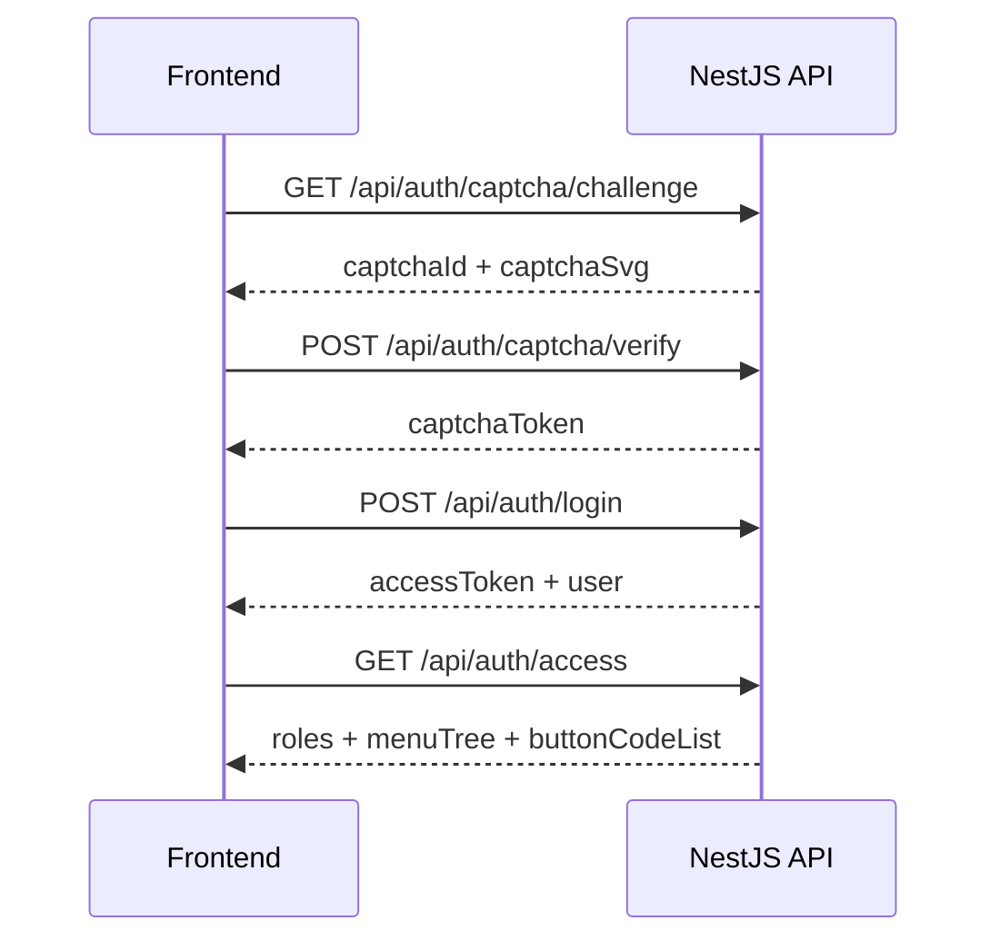

# 接口规范

## 基本约定

LuckyColor 后端统一通过 REST 风格接口对外提供能力，默认地址如下：

| 项目 | 地址 |
| --- | --- |
| 服务根地址 | `http://127.0.0.1:3001` |
| 全局接口前缀 | `/api` |
| Swagger 文档 | `http://127.0.0.1:3001/docs` |

也就是说，前端真正调用的接口通常形如：

```text
http://127.0.0.1:3001/api/users
```

## 统一返回结构

LuckyColor 的成功与失败响应都采用统一结构：

```json
{
  "code": 200,
  "msg": "success",
  "data": {}
}
```

错误响应示例：

```json
{
  "code": 1016001,
  "msg": "请求参数校验失败",
  "data": null
}
```

## 请求头约定

### 认证头

除公开接口外，默认需要 Bearer Token：

```http
Authorization: Bearer <access_token>
```

### 租户头

在多租户模式下，开发和联调时通常会显式带上：

```http
x-tenant-id: tenant_001
```

后端也支持从域名后缀或 Token 中识别租户，但在开发环境里，Header 是最直接、最容易排查的方式。

## 分页约定

大部分后台列表接口使用以下分页参数：

| 参数 | 说明 |
| --- | --- |
| `page` | 页码 |
| `size` | 每页条数 |
| `keyword` / 其他筛选项 | 业务过滤条件 |

典型分页返回：

```json
{
  "code": 200,
  "msg": "success",
  "data": {
    "total": 20,
    "current": 1,
    "size": 10,
    "records": []
  }
}
```

## 公开接口与受保护接口

### 公开接口

通常无需登录即可访问：

- `GET /api/health`
- `GET /api/auth/captcha/challenge`
- `POST /api/auth/captcha/verify`
- `POST /api/auth/login`

### 受保护接口

这类接口通常需要：

1. Token 合法
2. 当前账号未被禁用
3. 当前角色有效
4. 当前租户状态正常
5. 具备菜单权限或按钮权限
6. 满足数据权限范围

## 模块分组

### 1. 认证中心

前缀：`/api/auth`

| 方法 | 路径 | 用途 |
| --- | --- | --- |
| `GET` | `/captcha/challenge` | 获取登录算术验证码 |
| `POST` | `/captcha/verify` | 校验验证码并换取一次性验证码令牌 |
| `POST` | `/login` | 用户名密码登录 |
| `POST` | `/logout` | 退出登录并记录安全审计 |
| `GET` | `/profile` | 当前用户资料 |
| `GET` | `/access` | 当前用户访问快照 |
| `GET` | `/routes` | 当前用户动态路由树 |
| `GET` | `/button-permissions` | 当前用户按钮权限查询 |

### 2. 系统管理

| 模块 | 前缀 | 典型能力 |
| --- | --- | --- |
| 用户管理 | `/api/users` | 分页、详情、创建、更新、导入、导出、状态、重置密码、分配角色、删除 |
| 角色管理 | `/api/roles` | 分页、详情、数据权限、菜单授权、状态维护、删除 |
| 菜单管理 | `/api/menus` | 分页、树、详情、创建、同步、状态维护、删除 |
| 部门管理 | `/api/departments` | 列表、树、详情、创建、更新、状态维护、删除 |
| 字典管理 | `/api/dict` | 树、分页、选项、详情、创建、刷新缓存、更新、删除 |
| 字典类型 | `/api/dict/types` | 类型分页和维护 |
| 字典项 | `/api/dict/items` | 字典项树、状态、排序维护 |
| 系统配置 | `/api/configs` | 分页、详情、创建、批量读取、刷新缓存、更新、删除 |
| 通知公告 | `/api/notices` | 分页、详情、创建、更新、发布、撤回、置顶、删除 |
| 系统日志 | `/api/system-logs` | 分页、详情、日志查看 |

### 3. 租户中心

| 模块 | 前缀 | 典型能力 |
| --- | --- | --- |
| 租户管理 | `/api/tenants` | 分页、详情、创建、更新 |
| 租户套餐 | `/api/tenant-packages` | 分页、详情、创建、更新、删除 |

### 4. 平台能力

| 模块 | 前缀 | 典型能力 |
| --- | --- | --- |
| 健康检查 | `/api/health` | 服务与数据库健康状态 |
| 工作台 | `/api/dashboard` | 概览、页面访问上报 |
| 文件服务 | `/api/file` | 上传、删除、文件访问 |
| 用户偏好 | `/api/preferences` | 当前用户偏好读取和保存 |
| 国际化资源 | `/api/i18n` | 多语言资源读取 |
| 水印配置 | `/api/watermark` | 当前水印配置 |
| 代码生成器 | `/api/codegen` | 表映射与模板元数据 |

## 关键业务链路

### 登录链路



### 页面初始化链路

1. 前端拿到 Token 后调用 `/api/auth/access`
2. 根据返回的 `menuTree` 初始化菜单与动态路由
3. 根据 `buttonCodeList` 控制按钮显隐
4. 页面业务数据再访问各自模块接口

### 租户创建链路

`POST /api/tenants` 不只是新增一条租户记录，还会触发一整套初始化动作：

- 创建租户
- 绑定套餐
- 创建默认部门
- 创建租户管理员和普通成员角色
- 创建租户管理员账号
- 绑定默认菜单和权限
- 初始化默认字典
- 写入租户审计日志

因此这个接口对平台初始化很关键。

## 常见错误码

| 错误码 | HTTP 状态 | 含义 |
| --- | --- | --- |
| `1011001` | `401` | 用户名或密码错误 |
| `1011003` | `401` | 需要先完成验证码校验 |
| `1011007` | `401` | Token 已过期 |
| `1011008` | `401` | Token 无效 |
| `1012001` | `403` | 操作权限不足 |
| `1012002` | `403` | 菜单权限不足 |
| `1012003` | `403` | 数据权限不足 |
| `1013001` | `403` | 租户访问被拒绝 |
| `1013002` | `403` | 租户已禁用 |
| `1013003` | `403` | 租户已过期 |
| `1014001` | `404` | 用户不存在 |
| `1014002` | `404` | 角色不存在 |
| `1014003` | `404` | 菜单不存在 |
| `1014004` | `404` | 租户不存在 |
| `1016001` | `422` | 请求参数校验失败 |
| `1016002` | `409` | 数据已存在 |

## 文件上传接口约定

文件上传使用 `multipart/form-data`：

- 上传：`POST /api/file/upload`
- 删除：`GET /api/file/delete?filePath=...`
- 读取：`GET /api/file/:filename`

这类接口在部署时要额外注意：

- Nginx 上传体积限制
- 文件存储目录持久化
- 多实例部署时的文件共享问题

## Swagger 使用建议

Swagger 是当前最准确的接口准绳，建议在以下场景优先查看：

- 不确定 DTO 字段名时
- 不确定错误响应码时
- 前端联调发现返回结构和预期不一致时
- 交付前核对接口是否真的开放时

## 前端联调建议

- 前端尽量只写相对路径 `/api/*`。
- 登录后优先调用 `/api/auth/access`，不要手写菜单。
- 本地联调时显式确认 `x-tenant-id` 是否正确。
- 如果接口 403，不要只查 Token，还要查角色、菜单、数据权限和租户状态。

## 如果后端以后切到 Java

只要接口路径、统一响应结构、租户 Header 和权限语义不变，这份文档大部分可以保留；如果这些也变化了，就需要和 [切换 Java 时的文档更新点](/backend/java-migration) 一起同步改。
