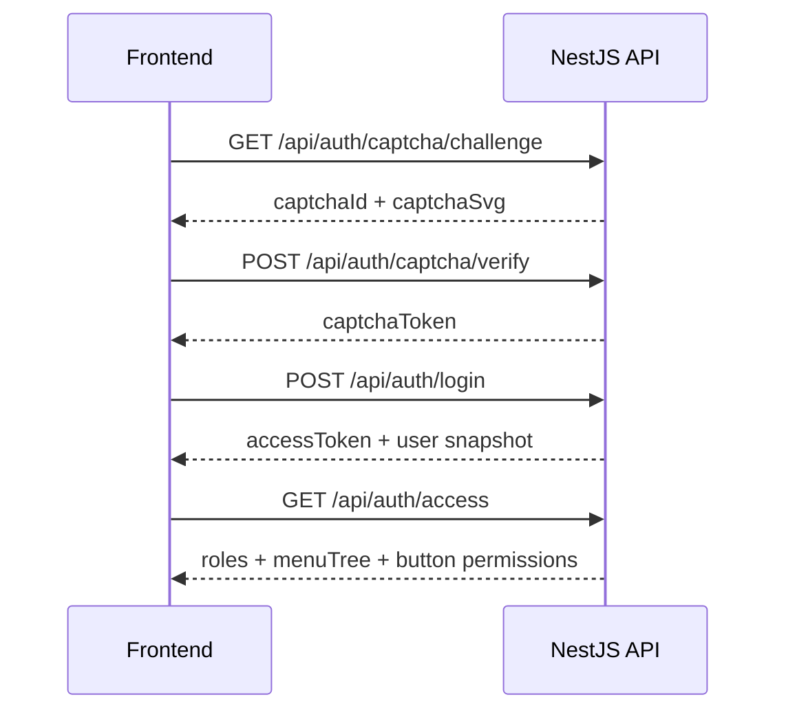

# 接口规范

## 基本约定

LuckyColor 后端服务统一基于 NestJS 暴露 REST 风格接口，服务默认监听：

```text
http://127.0.0.1:3001
```

全局接口前缀为：

```text
/api
```

Swagger 文档地址为：

```text
http://127.0.0.1:3001/docs
```

## 统一返回格式

后端 Swagger 响应封装显示，成功与失败都采用统一结构：

```json
{
  "code": 200,
  "msg": "success",
  "data": {}
}
```

错误响应示例：

```json
{
  "code": 1016001,
  "msg": "请求参数校验失败",
  "data": null
}
```

## 认证方式

除登录、验证码、健康检查等公开接口外，其他接口默认通过 `Bearer Token` 认证：

```http
Authorization: Bearer <access_token>
```

在多租户启用时，可通过请求头显式传递租户：

```http
x-tenant-id: tenant_001
```

## 主要接口分组

### 认证中心

前缀：`/api/auth`

| 方法 | 路径 | 说明 |
| --- | --- | --- |
| `GET` | `/captcha/challenge` | 获取登录算术验证码 |
| `POST` | `/captcha/verify` | 校验验证码 |
| `POST` | `/login` | 账号登录 |
| `POST` | `/logout` | 退出登录 |
| `GET` | `/profile` | 当前用户资料 |
| `GET` | `/access` | 当前用户权限快照 |
| `GET` | `/routes` | 当前用户动态路由树 |
| `GET` | `/button-permissions` | 当前用户按钮权限查询 |

### 系统管理

| 模块 | 前缀 | 典型能力 |
| --- | --- | --- |
| 用户管理 | `/api/users` | 分页、详情、创建、更新、状态、重置密码、分配角色、删除 |
| 角色管理 | `/api/roles` | 分页、详情、数据权限、菜单分配、创建、更新、状态、删除 |
| 菜单管理 | `/api/menus` | 列表、树、详情、创建、同步、更新、状态、删除 |
| 部门管理 | `/api/departments` | 列表、树、部门用户、创建、更新、状态、删除 |
| 字典管理 | `/api/dict` | 字典树、分页、选项、详情、创建、刷新缓存、更新、删除 |
| 字典类型 | `/api/dict/types` | 分页、详情、创建、更新、删除 |
| 字典项 | `/api/dict/items` | 列表、树、详情、状态修改、排序修改 |
| 系统配置 | `/api/configs` | 分页、批量读取、详情、创建、刷新缓存、更新、删除 |
| 通知公告 | `/api/notices` | 分页、详情、创建、更新、发布、撤回、置顶、删除 |
| 系统日志 | `/api/system-logs` | 分页、详情、写入 |

### 租户中心

| 模块 | 前缀 | 典型能力 |
| --- | --- | --- |
| 租户管理 | `/api/tenants` | 分页、创建、更新、详情 |
| 租户套餐 | `/api/tenant-packages` | 分页、创建、详情、更新、删除 |

### 平台能力

| 模块 | 前缀 | 典型能力 |
| --- | --- | --- |
| 健康检查 | `/api/health` | 服务健康状态 |
| 工作台 | `/api/dashboard` | 总览、访问追踪 |
| 文件服务 | `/api/file` | 上传、删除、访问 |
| 用户偏好 | `/api/preferences` | 当前用户偏好读取与更新 |
| 国际化资源 | `/api/i18n` | 多语言资源查询 |
| 水印配置 | `/api/watermark` | 当前水印配置读取 |
| 代码生成器 | `/api/codegen` | 表映射、模板、前端元数据 |

## 核心登录流程



## 常见业务错误码

| 错误码 | HTTP 状态 | 含义 |
| --- | --- | --- |
| `1011001` | `401` | 用户名或密码错误 |
| `1011003` | `401` | 需要先完成验证码校验 |
| `1011007` | `401` | Token 已过期 |
| `1011008` | `401` | Token 无效 |
| `1012001` | `403` | 操作权限不足 |
| `1012002` | `403` | 菜单权限不足 |
| `1012003` | `403` | 数据权限不足 |
| `1013002` | `403` | 租户已禁用 |
| `1013003` | `403` | 租户已过期 |
| `1014001` | `404` | 用户不存在 |
| `1014002` | `404` | 角色不存在 |
| `1014003` | `404` | 菜单不存在 |
| `1016001` | `422` | 请求参数校验失败 |
| `1016002` | `409` | 数据已存在 |

## 前端联调建议

- 以 Swagger 为接口入参和返回结构的准绳。
- 前端只拼接 `/api` 路径，不在业务代码里硬编码完整域名。
- 登录后优先拉取 `/api/auth/access`，再初始化菜单和按钮权限。
- 涉及多租户调试时，确认是否需要补充 `x-tenant-id` 请求头。
