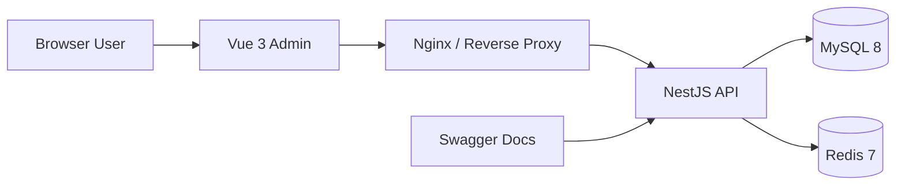

# 系统架构总览

## 整体架构



## 架构说明

系统采用典型的前后端分离架构：

- 前端项目 `luckyColor-admin` 基于 Vite 构建，负责页面渲染、状态管理、菜单与权限路由处理。
- 后端项目 `luckyColor-admin-serve` 基于 NestJS，负责认证鉴权、业务逻辑、数据访问与 OpenAPI 文档输出。
- MySQL 承载业务主数据，Redis 用于缓存与加速。
- 开发环境下前端通过 Vite 代理把 `/api` 请求转发到 `http://127.0.0.1:3001`。
- 后端统一使用 `/api` 作为全局前缀，并在 `/docs` 暴露 Swagger 页面。

## 前端结构

```text
luckyColor-admin/
├─ src/
│  ├─ api/
│  ├─ components/
│  ├─ config/
│  ├─ layouts/
│  ├─ router/
│  ├─ store/
│  ├─ utils/
│  └─ views/
└─ vite.config.ts
```

前端的几个关键点：

- 通过 `vite.config.ts` 配置本地开发端口和 `/api` 代理。
- 通过 `src/config/index.ts` 统一管理接口地址、Swagger 地址、租户 Header 和默认登录信息。
- 页面模块主要集中在 `src/views`，系统布局在 `src/layouts`，状态管理在 `src/store`。

## 后端结构

```text
luckyColor-admin-serve/
├─ src/
│  ├─ modules/
│  │  ├─ iam/
│  │  ├─ system/
│  │  ├─ tenant/
│  │  └─ platform/
│  ├─ infra/
│  ├─ shared/
│  └─ generated/
├─ prisma/
├─ test/
└─ docker-compose.yml
```

后端按领域拆分模块：

- `iam`：登录、认证、权限与访问控制
- `system`：用户、角色、菜单、部门、字典、配置、公告、日志
- `tenant`：租户与租户套餐
- `platform`：健康检查、仪表盘、文件服务、代码生成等平台能力

## 多租户说明

后端已具备多租户上下文能力，租户识别优先级为：

1. 请求头 `x-tenant-id`
2. 域名后缀匹配
3. 登录态 Token
4. 默认租户配置

这意味着系统既支持开发环境直接通过 Header 指定租户，也适合后续扩展为二级域名或独立域名租户模式。
