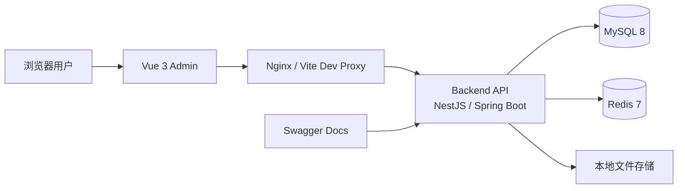

# 系统架构总览

## 架构一句话概括

LuckyColor 采用典型的前后端分离架构：前端负责登录、菜单、页面交互和权限显隐，后端负责认证鉴权、租户隔离、业务处理和数据访问，MySQL 承载主数据，Redis 提供缓存与辅助能力，Nginx 负责统一入口与反向代理。当前后端已经同时存在 NestJS 与 Spring Boot 两套实现，前端通过不同联调模式切换目标服务。

## 运行架构图



## 四个仓库的关系

| 仓库 | 位置 | 主要职责 |
| --- | --- | --- |
| `luckyColor-docs` | `https://github.com/Liu-code3/luckyColor-docs` | 维护产品、技术与部署文档 |
| `luckyColor-admin` | `https://github.com/Liu-code3/luckyColor-admin` | 渲染后台页面、处理菜单路由、调用接口 |
| `luckyColor-admin-serve` | `https://github.com/Liu-code3/luckyColor-admin-serve` | NestJS 实现，输出 REST API、权限校验、租户隔离、数据库读写 |
| `luckycolor-admin-springboot` | `D:\zl\luckycolor-admin-springboot` | Spring Boot 实现，输出与前端兼容的 REST API、权限校验、租户隔离、数据库读写 |

文档站不是独立存在的，它描述的是这几个真实仓库之间的协作方式。

## 项目组织架构怎么理解

如果从“接手一个真实项目”这个视角看，LuckyColor 其实不是一个仓库，而是三层协作结构：

1. `luckyColor-docs` 负责把产品规则、技术结构、部署方式和协作口径讲清楚。
2. `luckyColor-admin` 负责把后端返回的菜单、权限、租户上下文和业务数据变成可操作页面。
3. `luckyColor-admin-serve` 和 `luckycolor-admin-springboot` 分别用 Node.js 与 Java 技术栈实现同一套后台规则与接口能力。

可以把它理解成：

- 文档仓库负责“讲清楚”
- 前端仓库负责“展示出来”
- 后端仓库负责“执行规则”

这样看项目，会比单纯记目录名更容易建立整体感。

## 一次典型请求链路

### 登录链路


### 页面访问链路

1. 前端进入页面时先检查本地 Token。
2. 如果没有动态路由，会基于 `/api/auth/access` 的菜单树恢复菜单状态。
3. 页面里的数据请求统一走 `/api/*`。
4. 后端根据登录态和租户上下文收敛到当前租户数据范围。
5. 查询结果通过统一响应结构返回前端。

## 前端架构拆分

```text
luckyColor-admin/
├─ src/api/                  接口封装
├─ src/views/                页面模块
├─ src/layouts/              布局与导航壳层
├─ src/store/                Pinia 状态管理
├─ src/router/               静态路由与动态路由恢复
├─ src/utils/http/           Axios 封装、拦截器、异常处理
├─ src/utils/auth*           登录态恢复、租户上下文、权限初始化
└─ src/config/               运行配置与默认值
```

前端核心特点：

- 开发环境通过 `vite.config.ts` 将 `/api` 代理到当前模式对应的后端，默认 `pnpm dev` 指向 `http://127.0.0.1:3001`，`pnpm dev:nestjs` 指向 `http://127.0.0.1:3002`。
- 动态菜单由后端返回，前端 `menu` store 负责标准化、缓存与注册动态路由。
- 登录后会拉取当前用户权限快照，再决定菜单、按钮和标签页行为。
- 默认支持租户 Header 透传，开发环境会自动带 `x-tenant-id: tenant_001`。

### 前端代码组织风格

前端不是按“某个大页面一个大目录、所有逻辑都塞组件里”的方式堆起来的，而是更偏平台型后台的拆法：

| 层次 | 典型目录 | 负责什么 |
| --- | --- | --- |
| 壳层 | `src/layouts`、`src/App.vue` | 定义后台整体外观、导航、标签页和主题 |
| 状态层 | `src/store` | 管菜单、多标签页、全局主题、布局状态 |
| 路由层 | `src/router` | 处理静态路由、动态路由恢复、登录跳转 |
| 页面层 | `src/views` | 承载真实业务页面和交互 |
| 接口映射层 | `src/api` | 把后端模块能力映射成前端可调用方法 |
| 通用能力层 | `src/utils`、`src/config` | 处理认证、租户、菜单标准化、请求封装 |

这种风格的重点不是“页面写得多快”，而是“业务规模变大以后，页面、路由、状态和接口还能不能继续清楚”。

## 后端架构拆分

当前后端有两套实现：

- `NestJS`：适合回看原始模块拆分、Prisma 数据模型与既有 Node.js 工程组织。
- `Spring Boot`：适合当前默认联调、Java 技术栈交付与长期维护。

两套实现都尽量保持 `/api`、`x-tenant-id`、登录鉴权、权限快照与动态菜单契约稳定。

```text
luckyColor-admin-serve/
├─ src/modules/iam/          认证、权限、数据权限
├─ src/modules/system/       用户、角色、菜单、部门、字典、配置、公告、日志
├─ src/modules/tenant/       租户与租户套餐
├─ src/modules/platform/     工作台、文件、健康检查、偏好、水印、国际化、代码生成
├─ src/infra/database/       Prisma 数据访问
├─ src/infra/cache/          Redis 能力
├─ src/infra/tenancy/        多租户上下文
├─ src/infra/security/       密码与安全工具
└─ src/shared/               环境校验、响应封装、异常过滤器等
```

后端核心特点：

- 所有接口统一挂在 `/api` 前缀下。
- Swagger 通过 `/docs` 暴露。
- 环境变量会在启动时做严格校验。
- 权限校验由菜单权限、按钮权限、数据权限、租户边界共同组成。
- 创建租户时会自动初始化默认管理员、角色、部门、菜单授权和基础字典。

### 后端代码组织风格

后端也不是按“所有 controller 放一起、所有 service 放一起”的方式平铺，而是按业务域模块化组织：

| 层次 | 典型目录 | 负责什么 |
| --- | --- | --- |
| 业务模块层 | `src/modules/iam`、`system`、`tenant`、`platform` | 按领域拆分功能边界 |
| 模块内实现层 | `controller`、`service`、`dto`、`response.dto` | 处理接口入口、业务规则、参数校验、返回结构 |
| 基础设施层 | `src/infra` | Prisma、Redis、多租户上下文、安全工具 |
| 公共支撑层 | `src/shared` | 全局响应、异常过滤、环境校验、Swagger 装饰器 |
| 数据模型层 | `prisma/` | Schema、seed、初始化脚本 |

这种组织方式的好处是：

- 先按业务边界分清模块，再在模块内部继续分 controller、service、dto。
- 业务代码不会和 Prisma、Redis、租户上下文细节混在一起。
- 新人既可以按“模块”看，也可以按“请求流转”看。

如果你当前主要使用 Spring Boot，可继续阅读 [Spring Boot 后端说明](/backend/springboot-overview)；如果你要对照既有 Node.js 实现，再阅读 [NestJS 后端说明](/backend/overview)。

## 数据与缓存职责

### MySQL

MySQL 承载主数据，包括：

- 租户、租户套餐、租户审计日志
- 用户、角色、菜单、部门和它们之间的映射关系
- 字典、系统配置、通知公告
- 工作台访问日志、系统日志、安全审计日志
- 用户偏好、水印配置、代码生成元数据

### Redis

Redis 当前主要承担：

- 登录验证码挑战与校验令牌
- 字典缓存刷新后的结果缓存
- 其他轻量缓存与加速类能力

## 多租户上下文是如何流转的

租户识别优先级为：

1. 请求头 `x-tenant-id`
2. 域名后缀
3. Token 中的租户信息
4. 默认租户配置

在后端中，租户上下文会先进入 `infra/tenancy`，再由服务层用于数据库查询和写入限制。这样做的好处是：

- 前端联调时容易显式指定租户
- 后续改为二级域名租户模式时可以平滑演进
- 业务层不需要到处手动传 `tenant_id`

## 权限模型在架构中的位置

系统不是只有“登录”这一层权限，而是四层叠加：

1. 登录态：判断用户是否已认证。
2. 菜单权限：判断能不能进入某个模块。
3. 按钮权限：判断能不能执行某个动作。
4. 数据权限与租户边界：判断能看到哪部分数据、能不能访问这个租户。

这也是为什么前端需要动态菜单和按钮权限，后端还需要再次做服务端校验。

## 业务功能是怎么映射到前后端的

如果你在接手时最怕“知道有这个功能，但不知道代码在哪”，可以先用这张对应关系表：

| 功能域 | 前端主要落点 | 后端主要落点 |
| --- | --- | --- |
| 登录与会话恢复 | `views/login`、`utils/auth*` | `modules/iam/auth` |
| 菜单、按钮、动态路由 | `store/modules/menu.ts`、`router` | `modules/iam/permissions`、`modules/system/menus` |
| 用户、角色、部门 | `views/sys/*`、`api/users.ts`、`api/roles.ts` | `modules/system/users`、`roles`、`departments` |
| 字典、配置、公告 | `views/sys/dict`、`config`、`notice` | `modules/system/dictionary`、`configs`、`notices` |
| 租户、租户套餐 | `views/sys/tenant`、`tenantPackage` | `modules/tenant/tenants`、`tenant-packages` |
| 工作台、偏好、水印、文件 | `views/index`、工具页、上传组件 | `modules/platform/dashboard`、`preferences`、`watermark`、`file` |

你可以把这看成一条简单主线：

- 前端页面负责“把能力展示出来”
- 前端 API 层负责“把请求发出去”
- 后端模块负责“把业务规则执行掉”
- 数据库和缓存负责“把结果落下来”

## 部署层视角

在生产环境里，通常会把 Vite 开发代理替换成 Nginx：

- `/` 指向前端构建后的静态资源
- `/api/` 反代到当前使用的后端服务
- Swagger 入口按实现不同可能是 `/api/docs` 或 `/docs`
- HTTPS 在 Nginx 层终止

如果是 Docker Compose 方案，则常见容器包括 `mysql`、`redis`、`server`、`admin`、`nginx`。

## 阅读建议

- 想快速理解页面和接口对应关系，下一步看“前端说明”和“后端说明”。
- 想理解权限和菜单为什么这么设计，继续看“权限安全”。
- 想部署，直接进入“部署方案”章节。

## 推荐的渐进式理解路径

如果你是第一次接手 LuckyColor，最顺手的路径不是直接钻进某个目录，而是按下面顺序：

1. 先看本页，建立“四个仓库怎么协作”的大图。
2. 再看 [产品概述](/guide/overview)，知道平台到底提供了哪些业务能力。
3. 然后看 [前端说明](/frontend/overview)，理解页面、路由、菜单、状态是怎么组织的。
4. 接着看 [后端说明](/backend/overview)，理解模块、权限、租户和数据库是怎么组织的。
5. 如果要顺着代码读，再进入前后端各自的“模块渐进式解读”。
