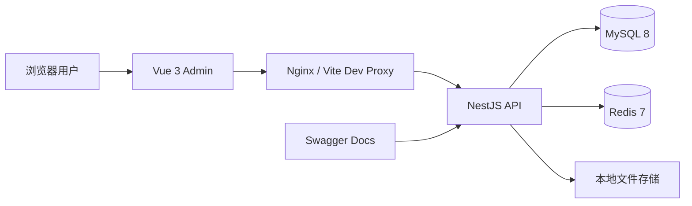
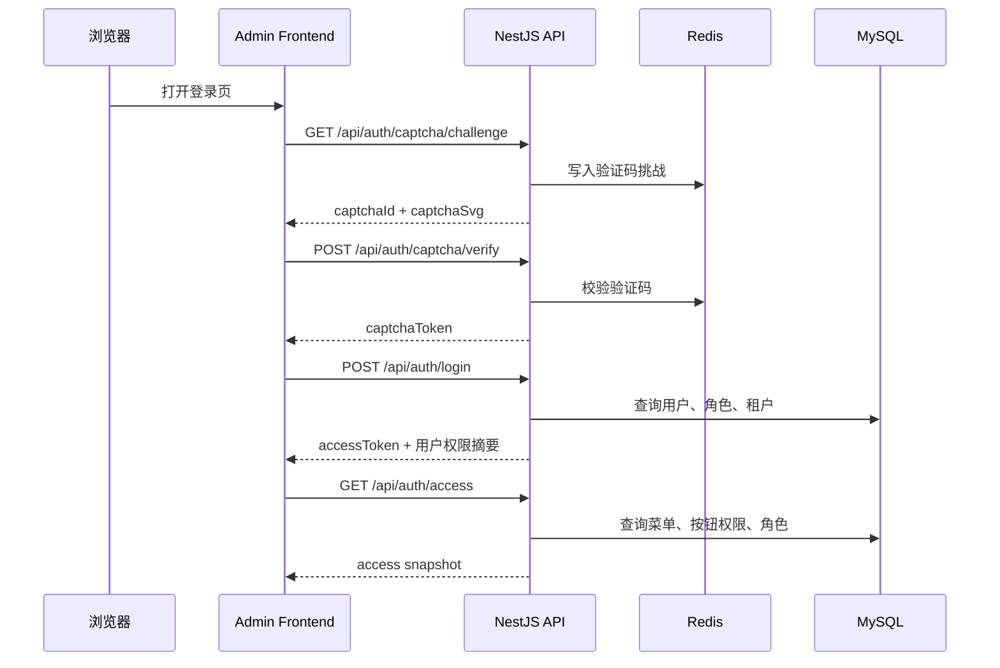

# 系统架构总览

## 架构一句话概括

LuckyColor 采用典型的前后端分离架构：前端负责登录、菜单、页面交互和权限显隐，后端负责认证鉴权、租户隔离、业务处理和数据访问，MySQL 承载主数据，Redis 提供缓存与辅助能力，Nginx 负责统一入口与反向代理。

## 运行架构图



## 三个仓库的关系

| 仓库 | 位置 | 主要职责 |
| --- | --- | --- |
| `luckyColor-docs` | `https://github.com/Liu-code3/luckyColor-docs` | 维护产品、技术与部署文档 |
| `luckyColor-admin` | `https://github.com/Liu-code3/luckyColor-admin` | 渲染后台页面、处理菜单路由、调用接口 |
| `luckyColor-admin-serve` | `https://github.com/Liu-code3/luckyColor-admin-serve` | 输出 REST API、权限校验、租户隔离、数据库读写 |

文档站不是独立存在的，它描述的是这两个真实业务仓库的协作方式。

## 一次典型请求链路

### 登录链路



### 页面访问链路

1. 前端进入页面时先检查本地 Token。
2. 如果没有动态路由，会基于 `/api/auth/access` 的菜单树恢复菜单状态。
3. 页面里的数据请求统一走 `/api/*`。
4. 后端根据登录态和租户上下文收敛到当前租户数据范围。
5. 查询结果通过统一响应结构返回前端。

## 前端架构拆分

```text
luckyColor-admin/
├─ src/api/                  接口封装
├─ src/views/                页面模块
├─ src/layouts/              布局与导航壳层
├─ src/store/                Pinia 状态管理
├─ src/router/               静态路由与动态路由恢复
├─ src/utils/http/           Axios 封装、拦截器、异常处理
├─ src/utils/auth*           登录态恢复、租户上下文、权限初始化
└─ src/config/               运行配置与默认值
```

前端核心特点：

- 开发环境通过 `vite.config.ts` 将 `/api` 代理到 `http://127.0.0.1:3001`。
- 动态菜单由后端返回，前端 `menu` store 负责标准化、缓存与注册动态路由。
- 登录后会拉取当前用户权限快照，再决定菜单、按钮和标签页行为。
- 默认支持租户 Header 透传，开发环境会自动带 `x-tenant-id: tenant_001`。

## 后端架构拆分

```text
luckyColor-admin-serve/
├─ src/modules/iam/          认证、权限、数据权限
├─ src/modules/system/       用户、角色、菜单、部门、字典、配置、公告、日志
├─ src/modules/tenant/       租户与租户套餐
├─ src/modules/platform/     工作台、文件、健康检查、偏好、水印、国际化、代码生成
├─ src/infra/database/       Prisma 数据访问
├─ src/infra/cache/          Redis 能力
├─ src/infra/tenancy/        多租户上下文
├─ src/infra/security/       密码与安全工具
└─ src/shared/               环境校验、响应封装、异常过滤器等
```

后端核心特点：

- 所有接口统一挂在 `/api` 前缀下。
- Swagger 通过 `/docs` 暴露。
- 环境变量会在启动时做严格校验。
- 权限校验由菜单权限、按钮权限、数据权限、租户边界共同组成。
- 创建租户时会自动初始化默认管理员、角色、部门、菜单授权和基础字典。

## 数据与缓存职责

### MySQL

MySQL 承载主数据，包括：

- 租户、租户套餐、租户审计日志
- 用户、角色、菜单、部门和它们之间的映射关系
- 字典、系统配置、通知公告
- 工作台访问日志、系统日志、安全审计日志
- 用户偏好、水印配置、代码生成元数据

### Redis

Redis 当前主要承担：

- 登录验证码挑战与校验令牌
- 字典缓存刷新后的结果缓存
- 其他轻量缓存与加速类能力

## 多租户上下文是如何流转的

租户识别优先级为：

1. 请求头 `x-tenant-id`
2. 域名后缀
3. Token 中的租户信息
4. 默认租户配置

在后端中，租户上下文会先进入 `infra/tenancy`，再由服务层用于数据库查询和写入限制。这样做的好处是：

- 前端联调时容易显式指定租户
- 后续改为二级域名租户模式时可以平滑演进
- 业务层不需要到处手动传 `tenant_id`

## 权限模型在架构中的位置

系统不是只有“登录”这一层权限，而是四层叠加：

1. 登录态：判断用户是否已认证。
2. 菜单权限：判断能不能进入某个模块。
3. 按钮权限：判断能不能执行某个动作。
4. 数据权限与租户边界：判断能看到哪部分数据、能不能访问这个租户。

这也是为什么前端需要动态菜单和按钮权限，后端还需要再次做服务端校验。

## 部署层视角

在生产环境里，通常会把 Vite 开发代理替换成 Nginx：

- `/` 指向前端构建后的静态资源
- `/api/` 反代到后端 `3001`
- `/docs/` 反代到 Swagger
- HTTPS 在 Nginx 层终止

如果是 Docker Compose 方案，则常见容器包括 `mysql`、`redis`、`server`、`admin`、`nginx`。

## 阅读建议

- 想快速理解页面和接口对应关系，下一步看“前端说明”和“后端说明”。
- 想理解权限和菜单为什么这么设计，继续看“权限安全”。
- 想部署，直接进入“部署方案”章节。
