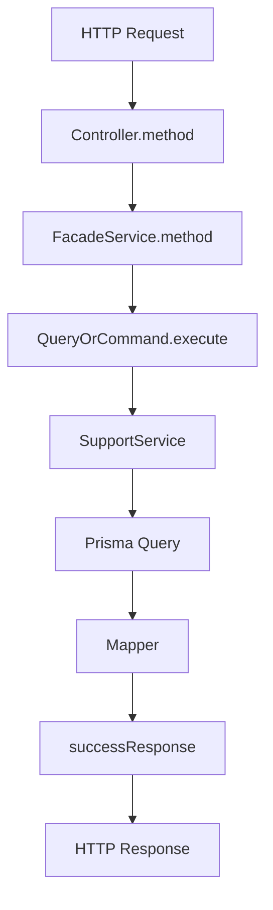

# 后端模块调用路径图模板

## 这页是做什么的

这页不是讲某一个具体模块，而是定义一套以后都能复用的讲解模板。

目标只有一个：

把“这个模块是怎么从 HTTP 请求一路执行到数据库，再把结果返回出来的”讲清楚。

这样后面无论讲 `users`、`roles`、`menus`、`tenants` 还是 `auth`，都能按同一套结构讲，不容易漏，也不容易越讲越散。

## 推荐讲解顺序

### 1. 先讲模块要解决什么问题

先不要急着讲代码目录。

先用一句话说清楚：

- 这个模块负责什么业务
- 它和哪些上游、下游模块协作
- 为什么它值得单独成为一个模块

示例句式：

`users` 负责后台账号的查询、创建、更新、禁用、导入导出和角色分配。

### 2. 再讲目录结构

推荐固定讲这几层：

- `controller`
- `service` 或 `facade service`
- `application/queries`
- `application/commands`
- `support`
- `mapper`
- `dto`
- `response.dto`

推荐配一个最小目录图：

```text
src/modules/<domain>/<module>/
├─ <module>.controller.ts
├─ <module>.service.ts
├─ <module>.dto.ts
├─ <module>.response.dto.ts
├─ application/
│  ├─ queries/
│  └─ commands/
├─ mappers/
└─ <module>-support.service.ts
```

### 3. 再讲“为什么这么拆”

要把“职责边界”说清楚，而不是只说“为了分层”。

推荐固定解释成下面这套：

- `controller`：接住 HTTP，请求参数进来，返回响应出去
- `facade service`：给现有 controller 提供稳定入口，先不让调用方感知内部重构
- `queries`：只做查询类 use case
- `commands`：只做写操作和状态变更类 use case
- `support`：放查询拼装、租户过滤、校验复用、解析工具这类公共支撑能力
- `mapper`：把 Prisma 结果映射成稳定的响应结构

### 4. 选 3 到 5 条最典型接口讲链路

优先选这几类：

- 一个列表查询
- 一个详情查询
- 一个创建命令
- 一个复杂写操作
- 一个批量导入或导出

这样能同时覆盖：

- 读链路
- 写链路
- 事务链路
- 权限/租户边界
- mapper 的返回整形

### 5. 每条接口固定讲 4 件事

每次都按下面这个顺序讲，会非常稳定：

1. 请求是从哪个 controller 方法进入的
2. facade service 把它转发给了哪个 command 或 query
3. support / infra / Prisma 分别在中间做了什么
4. 最后 response 是怎么组装回前端的

## 推荐文档结构

以后每个模块的讲解页都可以直接照这个结构写：

```md
# xxx 模块讲解

## 1. 这个模块负责什么
## 2. 当前目录结构
## 3. 当前拆分角色
## 4. 一条最小总链路
## 5. 典型接口调用路径图
## 6. 常见改动应该从哪里下手
## 7. 这个模块最容易踩坑的地方
```

## 推荐图例规范

为了后面不同模块的图看起来一致，建议统一：

- 矩形表示控制器、服务、命令、查询、支撑类
- 菱形只在真的有分支判断时再用
- 数据库访问统一写成 `Prisma.*`
- 返回前端统一落到 `successResponse`
- 如果有租户边界或权限边界，放在图的前半段

## 推荐的 Mermaid 模板



## 什么时候一定要补调用路径图

下面这些模块，建议都至少画 3 条以上调用路径图：

- 有导入导出
- 有事务
- 有跨模块权限判断
- 有租户范围过滤
- 有批量操作
- 一个 service 已经超过 300 行

## 当前建议的优先顺序

建议按这个顺序补图，收益最高：

1. `users`
2. `roles`
3. `menus`
4. `auth`
5. `tenants`

## 参考示例

可以直接配合阅读：

- `/backend/users-call-path`
