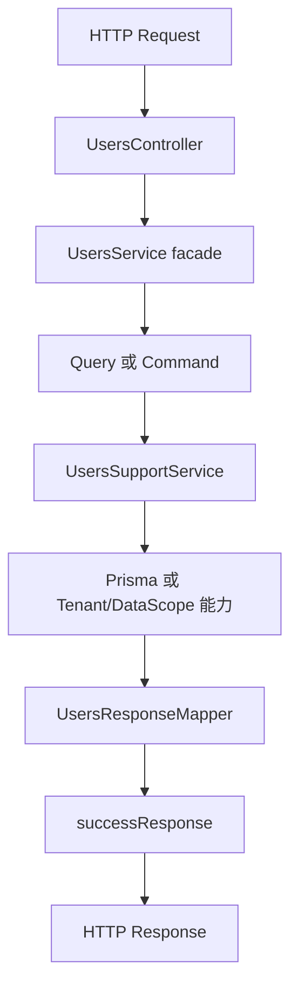
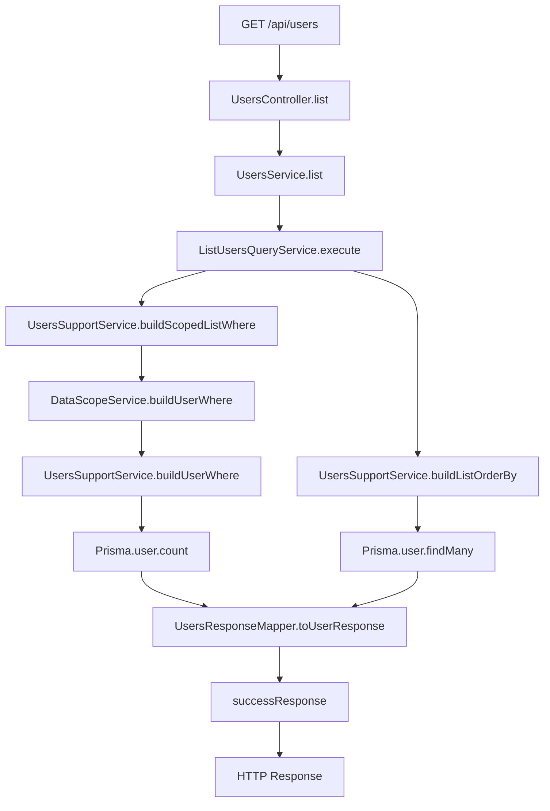
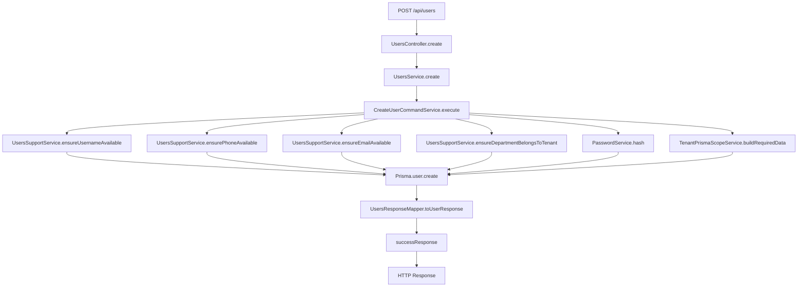
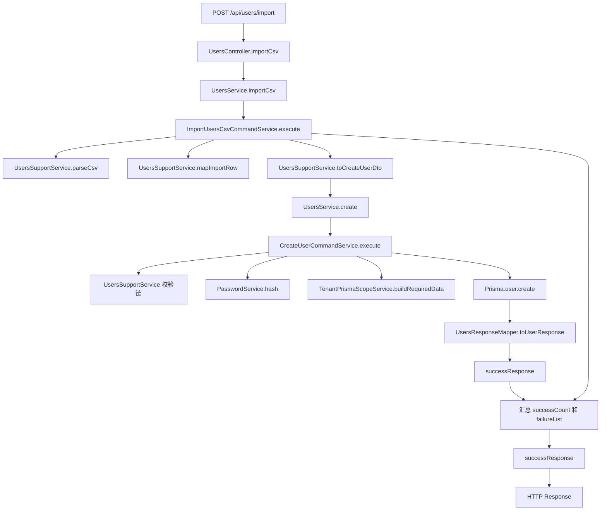
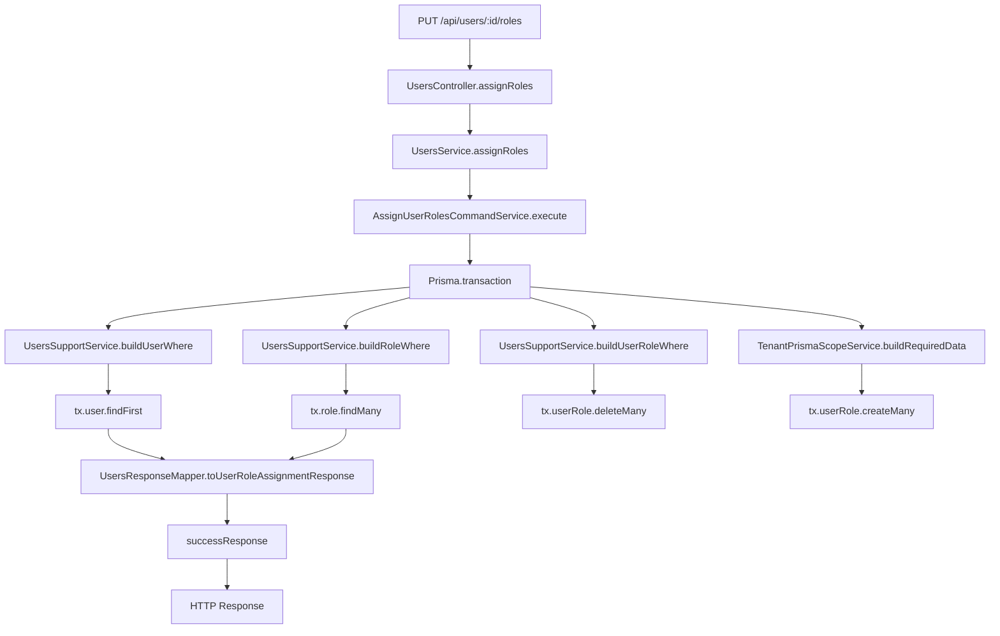

# users 模块调用路径详解

## 先用一句话理解 users 模块

`users` 模块负责后台用户管理这件事。

它不是只做一个简单的 CRUD，而是把这些事情一起兜住：

- 用户分页列表
- 用户详情
- 创建用户
- 更新用户
- 删除用户
- 启用和停用
- 重置密码
- 分配角色
- 导入 CSV
- 导出 CSV

## 当前拆分后的目录结构

```text
src/modules/system/users/
├─ users.controller.ts
├─ users.service.ts
├─ users.dto.ts
├─ users.response.dto.ts
├─ users.types.ts
├─ users-support.service.ts
├─ application/
│  ├─ queries/
│  │  ├─ list-users-query.service.ts
│  │  ├─ export-users-csv-query.service.ts
│  │  ├─ get-user-detail-query.service.ts
│  │  └─ get-user-roles-query.service.ts
│  └─ commands/
│     ├─ create-user-command.service.ts
│     ├─ update-user-command.service.ts
│     ├─ remove-user-command.service.ts
│     ├─ update-user-status-command.service.ts
│     ├─ reset-user-password-command.service.ts
│     ├─ assign-user-roles-command.service.ts
│     └─ import-users-csv-command.service.ts
└─ mappers/
   └─ users-response.mapper.ts
```

## 这个拆分到底是什么意思

如果你以前更熟悉的是：

`controller -> service -> mapper`

那现在可以先把它理解成“原来的 service 被拆成了一层 facade 加一组更细的 use case”。

也就是：

`controller -> facade service -> query/command -> support -> mapper`

其中：

- `UsersController` 还是对外 HTTP 入口
- `UsersService` 现在更像一个 facade，先保留原方法名，对 controller 保持兼容
- `queries` 专门放读操作
- `commands` 专门放写操作
- `UsersSupportService` 放复用校验、查询条件拼装、租户条件拼装、CSV 解析
- `UsersResponseMapper` 负责把数据库结果转成前端需要的响应结构

## 一条最小总链路

先看最抽象的一层：



这张图最重要的点是：

- `controller` 不直接塞复杂业务
- `users.service.ts` 不再独占所有逻辑
- 查询和写入开始分家
- 复用逻辑被收敛到 `support`
- 响应整形被收敛到 `mapper`

## 角色分工

### 1. UsersController

负责：

- 定义路由
- 挂权限装饰器
- 接 DTO
- 调用 `UsersService`

它不应该承担：

- 拼 Prisma where
- 直接写事务
- 处理 CSV 解析细节
- 组装响应字段

### 2. UsersService

现在它的定位不是“大总管业务实现类”，而是“兼容层 + 门面层”。

它做的事情很薄：

- 在构造函数里把 command/query/support/mapper 组织起来
- 暴露旧方法名，比如 `list()`、`create()`、`assignRoles()`
- 把请求转发给真正的 query 或 command

这一步的价值是：

先把结构拆开，但不强迫 `controller`、测试、调用方一起大改。

### 3. Queries

当前查询类包括：

- `ListUsersQueryService`
- `ExportUsersCsvQueryService`
- `GetUserDetailQueryService`
- `GetUserRolesQueryService`

它们只负责“读”，不改状态。

### 4. Commands

当前命令类包括：

- `CreateUserCommandService`
- `UpdateUserCommandService`
- `RemoveUserCommandService`
- `UpdateUserStatusCommandService`
- `ResetUserPasswordCommandService`
- `AssignUserRolesCommandService`
- `ImportUsersCsvCommandService`

它们负责：

- 写数据库
- 做校验
- 处理事务
- 承担状态变更

### 5. UsersSupportService

这是 users 模块现在最关键的“支撑层”。

它集中承接了这些复用逻辑：

- `buildUserWhere` 这类租户边界 where 包装
- `buildScopedListWhere` 这类数据权限 + 列表条件拼装
- 用户名、手机号、邮箱唯一性校验
- 部门归属校验
- CSV 解析
- 导入行转 DTO
- 导入错误原因翻译

### 6. UsersResponseMapper

负责两类映射：

- `toUserResponse`
- `toUserRoleAssignmentResponse`

它的价值是把数据库结构和接口输出结构隔开，避免 Prisma 查询结果直接裸着返回给前端。

## 典型调用路径图

下面这几条，是后面给团队讲解时最值得直接展示的链路。

### 1. 用户分页列表

接口：

- `GET /api/users`

适合讲什么：

- 数据权限
- 租户边界
- 查询条件拼装
- mapper 统一输出



这一条链路里可以重点讲 3 个点：

- 不是 controller 直接查库，而是进入 `ListUsersQueryService`
- 数据权限先由 `DataScopeService` 收缩，再叠加租户条件
- `mapper` 保证返回结构稳定

### 2. 创建用户

接口：

- `POST /api/users`

适合讲什么：

- 唯一性校验
- 密码哈希
- 租户写入边界
- 写操作如何和查询操作分开



这一条能很好回答一个问题：

为什么要把创建逻辑从 `users.service.ts` 里拆出来。

因为这条链路天然就是一个独立 use case，它有自己的校验、写入和返回结构。

### 3. 批量导入 CSV

接口：

- `POST /api/users/import`

适合讲什么：

- 批处理
- 复用已有创建逻辑
- 导入失败原因汇总



这里最关键的设计点是：

导入并没有重新发明一套“创建用户”逻辑，而是最终回到 `UsersService.create()`，继续复用已经拆好的创建命令。

这能避免：

- 导入和单个创建规则不一致
- 后续改创建校验时漏改导入

### 4. 分配用户角色

接口：

- `PUT /api/users/:id/roles`

适合讲什么：

- 事务
- 角色有效性校验
- 多表写入



这一条链路最适合拿来讲：

- 为什么“分配角色”不是一个普通 update
- 为什么它应该是一个独立 command
- 为什么这里需要事务包裹

## 如果你还是习惯 controller -> service -> mapper

可以先把现在的结构，脑子里映射成下面这套过渡理解：

```text
以前:
controller -> service -> mapper

现在:
controller -> facade service -> 专用 query/command -> support -> mapper
```

也就是说，本质上不是把原来的思路彻底推翻，而是把原来那个过胖的 `service` 拆细了。

## 常见改动应该从哪里下手

### 改用户列表筛选条件

优先看：

- `users.controller.ts`
- `users.dto.ts`
- `application/queries/list-users-query.service.ts`
- `users-support.service.ts`

### 改创建用户校验

优先看：

- `application/commands/create-user-command.service.ts`
- `users-support.service.ts`

### 改导入规则

优先看：

- `application/commands/import-users-csv-command.service.ts`
- `users-support.service.ts`

### 改角色分配逻辑

优先看：

- `application/commands/assign-user-roles-command.service.ts`
- `mappers/users-response.mapper.ts`

## 这次拆分的真实收益

这次不是为了追求“看起来高级”，而是为了解决三个实际问题：

1. `users.service.ts` 继续膨胀下去，会越来越难改
2. 查询和写入混在一起时，阅读和测试成本会一直升高
3. 导入、分配角色、状态变更这类 use case，本来就应该有各自独立的入口

## 下一批最适合继续按同样方式拆的模块

建议优先级：

1. `roles`
2. `menus`
3. `auth`

原因很简单：

- 这几个模块同样有明显的查询链路和写链路
- 也都带权限、租户或事务特征
- 用同一套模板继续拆，团队会更容易形成统一认知
