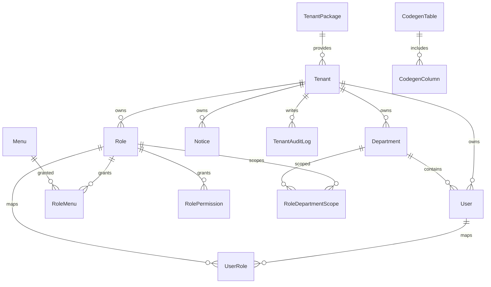

# 数据库设计

## 数据库选型

- 数据库：MySQL 8.x
- ORM：Prisma 5
- 连接配置：`DATABASE_URL`

当前 schema 主要围绕多租户后台系统设计，兼顾权限、配置、审计和平台能力。

## 领域划分

| 领域 | 主要表 |
| --- | --- |
| 租户中心 | `tenants`, `tenant_packages`, `tenant_audit_logs` |
| 组织权限 | `users`, `roles`, `menus`, `departments`, `user_roles`, `role_menus`, `role_permissions`, `role_department_scopes` |
| 系统配置 | `dictionaries`, `system_configs`, `notices` |
| 平台能力 | `dashboard_visits`, `i18n_resources`, `user_preferences`, `watermark_configs`, `codegen_tables`, `codegen_columns` |
| 审计日志 | `system_logs`, `security_audit_logs` |

## 核心实体关系

## 关键数据表说明

### `tenants`

租户主表，记录租户身份、状态、有效期和联系人信息。

关键字段：

| 字段 | 类型 | 说明 |
| --- | --- | --- |
| `id` | `String` | 租户 ID |
| `code` | `String` | 租户编码，唯一 |
| `name` | `String` | 租户名称 |
| `status` | `String` | 状态，如 `ACTIVE` |
| `expires_at` | `DateTime` | 到期时间 |
| `package_id` | `String` | 关联套餐 |

### `users`

租户用户表，按 `tenant_id + username` 做唯一约束。

关键字段：

| 字段 | 类型 | 说明 |
| --- | --- | --- |
| `id` | `String` | 用户 ID |
| `tenant_id` | `String` | 所属租户 |
| `department_id` | `Int` | 所属部门 |
| `username` | `String` | 登录账号 |
| `password` | `String` | 密码哈希 |
| `status` | `Boolean` | 启用状态 |
| `last_login_at` | `DateTime` | 最后登录时间 |

### `roles`

角色表，支持状态控制和数据权限范围。

关键字段：

| 字段 | 类型 | 说明 |
| --- | --- | --- |
| `tenant_id` | `String` | 所属租户 |
| `code` | `String` | 角色编码，租户内唯一 |
| `data_scope` | `String` | 数据权限范围 |
| `status` | `Boolean` | 启用状态 |

### `menus`

菜单表承载前端路由、菜单树和权限点绑定。

关键字段：

| 字段 | 类型 | 说明 |
| --- | --- | --- |
| `parent_id` | `Int` | 父菜单 |
| `title` | `String` | 菜单标题 |
| `type` | `Int` | 目录、菜单、按钮等类型 |
| `path` | `String` | 路由路径 |
| `menu_key` | `String` | 菜单唯一键 |
| `permission_code` | `String` | 绑定权限点 |
| `component` | `String` | 前端组件路径 |

### 关系表

| 表名 | 说明 |
| --- | --- |
| `user_roles` | 用户与角色多对多关系 |
| `role_menus` | 角色与菜单多对多关系 |
| `role_permissions` | 角色与直接权限点多对多关系 |
| `role_department_scopes` | 角色与可见部门范围的关系 |

## 多租户设计特点

- 绝大多数核心业务表都带 `tenant_id`。
- 唯一索引通常以 `tenant_id` 为作用域，例如用户、角色、部门。
- 平台级能力和租户级能力可以共存，例如字典支持全局与租户数据混合。
- 当前更像“共享数据库、共享表、逻辑隔离”的多租户模式。

## 索引设计思路

Prisma 中已为高频查询增加索引，主要方向有：

- `tenant_id + status`
- `tenant_id + created_at`
- 树结构字段，如 `parent_id`
- 权限映射字段，如 `role_id`, `menu_id`, `permission_code`

这说明当前模型更偏向后台管理查询场景，而不是高并发交易场景。

## 初始化数据

种子数据中包含以下基础能力：

- 默认租户：`tenant_001`
- 默认管理员：`admin / 123456`
- 默认角色：`super_admin`、`tenant_admin`、`tenant_member`
- 基础菜单、字典和权限初始化

## 设计建议

- 生产环境尽量把 `tenant_id` 作为查询和审计的强约束。
- 如果租户规模继续增大，可以逐步演进为分库分租户模式。
- 涉及统计类需求时，建议为日志和访问表增加冷热分层策略。
- 正式上线前，建议沉淀一份字段级数据字典和 ER 图版本文档。
