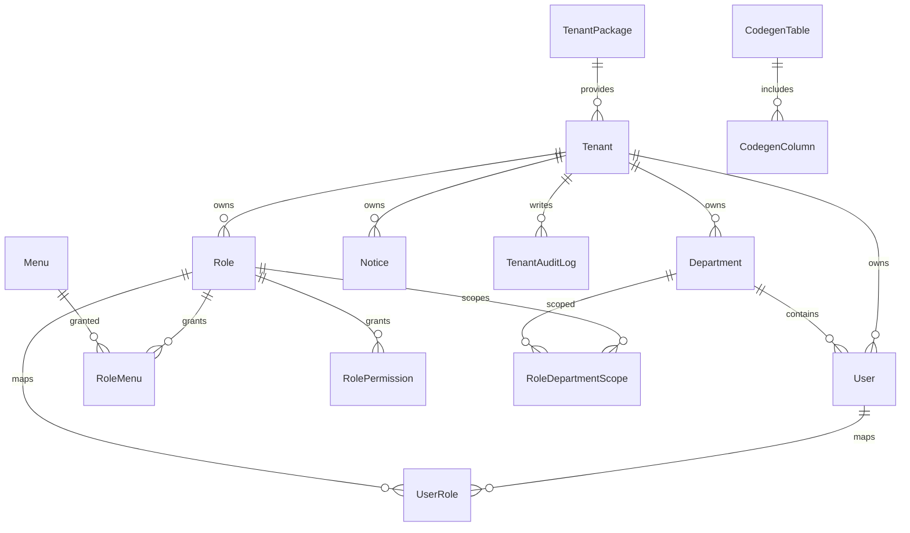

# 数据库设计

## 数据库选型

- 数据库：MySQL 8.x
- ORM：Prisma 5
- 连接入口：`DATABASE_URL`
- Schema 文件：`https://github.com/Liu-code3/luckyColor-admin-serve/blob/main/prisma/schema.prisma`

当前模型围绕“多租户后台管理平台”设计，重点不是交易型高并发，而是权限、组织、配置、审计和平台能力的结构化支撑。

## 数据域划分

| 领域 | 主要表 | 说明 |
| --- | --- | --- |
| 租户中心 | `tenants`、`tenant_packages`、`tenant_audit_logs` | 平台级租户与套餐管理 |
| 组织权限 | `users`、`roles`、`menus`、`departments`、`user_roles`、`role_menus`、`role_permissions`、`role_department_scopes` | 用户、角色、菜单、数据权限 |
| 系统配置 | `dictionaries`、`system_configs`、`notices` | 字典、配置、公告 |
| 平台能力 | `dashboard_visits`、`i18n_resources`、`user_preferences`、`watermark_configs`、`codegen_tables`、`codegen_columns` | 工作台、偏好、水印、国际化、代码生成 |
| 审计日志 | `system_logs`、`security_audit_logs` | 操作留痕与安全审计 |

## 核心实体关系

## 关键表说明

### 1. `tenant_packages`

租户套餐表，定义租户可用能力和配额上限。

关键字段：

| 字段 | 说明 |
| --- | --- |
| `id` | 套餐主键 |
| `code` | 套餐编码，唯一 |
| `name` | 套餐名称 |
| `status` | 套餐是否可用 |
| `max_users` / `max_roles` / `max_menus` | 套餐配额 |
| `feature_flags` | 预留功能开关 |

### 2. `tenants`

租户主表，是多租户数据隔离的起点。

关键字段：

| 字段 | 说明 |
| --- | --- |
| `id` | 租户 ID |
| `code` | 租户编码，唯一 |
| `name` | 租户名称 |
| `status` | `ACTIVE`、`FROZEN` 等状态 |
| `expires_at` | 到期时间 |
| `package_id` | 关联套餐 |
| `contact_*` | 联系人信息 |

### 3. `users`

租户用户表，按租户隔离账户。

关键字段：

| 字段 | 说明 |
| --- | --- |
| `tenant_id` | 所属租户 |
| `department_id` | 所属部门 |
| `username` | 登录账号，租户内唯一 |
| `password` | 密码哈希 |
| `status` | 启停状态 |
| `last_login_at` | 最后登录时间 |

约束特点：

- `tenant_id + username` 唯一
- `tenant_id + phone` 唯一
- `tenant_id + email` 唯一

### 4. `roles`

角色表，是菜单权限、按钮权限和数据权限的承载主体。

关键字段：

| 字段 | 说明 |
| --- | --- |
| `tenant_id` | 所属租户 |
| `code` | 角色编码，租户内唯一 |
| `data_scope` | 数据权限范围 |
| `status` | 启停状态 |
| `remark` | 角色说明 |

### 5. `menus`

菜单表同时承载前端路由、菜单树和按钮权限入口。

关键字段：

| 字段 | 说明 |
| --- | --- |
| `parent_id` | 父菜单 ID |
| `title` | 菜单标题 |
| `type` | 菜单类型，目录/菜单/按钮 |
| `path` | 路由路径 |
| `menu_key` | 菜单唯一标识 |
| `permission_code` | 按钮权限码或菜单权限码 |
| `component` | 前端组件路径 |
| `meta` | 前端渲染元数据 |
| `sort` | 排序 |

这张表是“前端动态路由”和“后端权限控制”之间最重要的连接点。

### 6. `departments`

部门表支持树结构。

关键字段：

| 字段 | 说明 |
| --- | --- |
| `tenant_id` | 所属租户 |
| `parent_id` | 父部门 |
| `name` | 部门名称 |
| `code` | 部门编码，租户内唯一 |
| `sort` | 排序 |
| `status` | 状态 |

### 7. `dictionaries`

字典表同时用于字典树、枚举选项和部分租户级配置补充。

关键字段：

| 字段 | 说明 |
| --- | --- |
| `id` | 字典节点 ID |
| `parent_id` | 父节点 |
| `tenant_id` | 所属租户，可为空表示平台级 |
| `dict_label` | 显示文本 |
| `dict_value` | 字典值 |
| `category` | 分类 |
| `sort_code` | 排序 |
| `status` | 启停状态 |

### 8. 关系表

| 表名 | 作用 |
| --- | --- |
| `user_roles` | 用户与角色多对多 |
| `role_menus` | 角色与菜单多对多 |
| `role_permissions` | 角色与按钮权限码多对多 |
| `role_department_scopes` | 角色与可见部门范围多对多 |

### 9. 审计和统计表

| 表名 | 作用 |
| --- | --- |
| `system_logs` | 业务操作留痕 |
| `security_audit_logs` | 登录、安全事件审计 |
| `tenant_audit_logs` | 租户创建与更新审计 |
| `dashboard_visits` | 工作台 PV、UV、最近访问统计 |

## 多租户设计特点

当前数据库模型属于“共享库、共享表、逻辑隔离”模式，特点是：

- 核心业务表普遍带有 `tenant_id`
- 唯一约束大多以 `tenant_id` 为作用域
- 平台级数据和租户级数据可以共存
- 新建租户时可自动写入一套租户默认数据

这对中小型 SaaS 平台非常实用，成本低，扩展快，但也要求所有查询与写入都严格遵守租户上下文。

## 默认数据初始化

执行 `pnpm db:setup` 后，系统会写入一批关键默认数据：

- 默认租户：`tenant_001`
- 默认管理员：`admin / 123456`
- 默认角色：`super_admin`、`tenant_admin`、`tenant_member`
- 默认菜单树和角色菜单授权
- 默认部门
- 基础字典、配置、公告和套餐数据

其中“创建新租户时还会自动初始化什么”，可以重点参考：

- `prisma/seed-manifest.ts`
- `src/modules/tenant/tenants/tenant-bootstrap.service.ts`

## 索引设计思路

当前 schema 已经对后台高频查询做了较多索引，主要集中在：

- `tenant_id + status`
- `tenant_id + created_at`
- `tenant_id + parent_id`
- `role_id`、`menu_id`、`permission_code`
- 树结构的 `parent_id`

这说明目前数据库设计更偏向：

- 分页查询
- 组织树查询
- 权限映射查询
- 审计日志按时间倒序查询

## 设计上的几个重点理解

### 菜单不是纯前端概念

`menus` 表既服务于前端动态路由，也服务于后端菜单权限控制，所以修改菜单结构时不能只改前端。

### 角色不仅控制菜单，还控制数据范围

`roles.data_scope` 和 `role_department_scopes` 决定了用户能看哪些组织数据，这也是为什么用户列表、导出等接口会受数据权限影响。

### 字典兼具平台和租户属性

`dictionaries.tenant_id` 可以为空，也可以指向某个租户，因此它既能做平台级枚举，也能做租户级字典扩展。

### 审计表是交付排查的重要依据

上线后如果出现“谁改了角色”“谁创建了租户”“谁登录失败很多次”这类问题，相关信息主要就落在审计和日志表里。

## 变更数据库时的同步要求

只要改了 `schema.prisma`，建议至少同步检查：

1. `prisma/seed.ts` 或相关 seed-data 是否需要更新
2. 前后端 DTO 和接口字段是否需要更新
3. `database/design.md` 是否需要更新
4. 如果影响权限、菜单、租户，还要同步更新 `api/spec.md` 和 `security/rbac.md`

## 后续演进建议

- 当租户规模继续增大时，可以评估从共享表演进到分库或分租户策略。
- `system_logs`、`security_audit_logs`、`dashboard_visits` 这类时间序列数据未来可以考虑冷热分层。
- 如果后端后续切换为 Java 或更换 ORM，也要同步更新数据库初始化方式和迁移文档。
