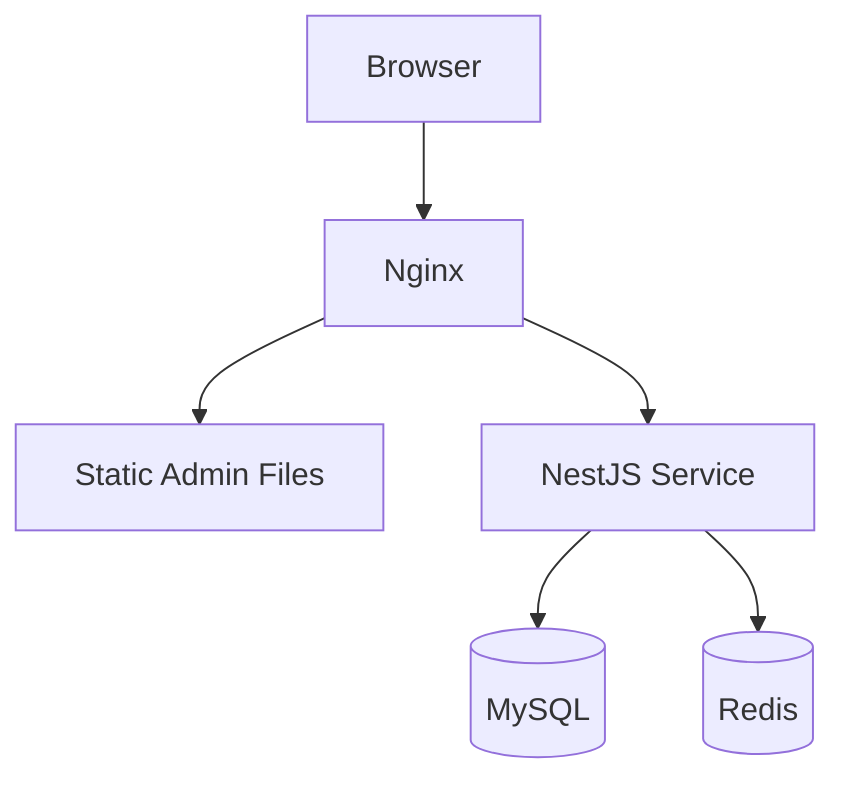
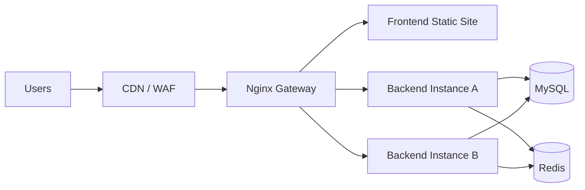

# 拓扑建议

## 方案一：单机部署

适合早期演示、试运行或小团队内部使用。

特点：

- 成本低
- 部署简单
- 运维门槛低

## 方案二：标准三层部署

适合正式对外提供服务的中小型 SaaS 项目。

特点：

- 可以水平扩展后端
- 前端和后端职责清晰
- 更适合持续交付和灰度升级

## 方案三：多租户进阶方案

适合租户规模变大、隔离要求更高的阶段。

- 入口层按域名或二级域名区分租户
- 网关层统一做鉴权、限流、审计
- 应用层共享服务代码，但按租户上下文隔离数据
- 数据层可逐步从共享库共享表升级到共享库分租户或独立库模式

## 选型建议

| 阶段 | 推荐方案 |
| --- | --- |
| 内部开发 / 演示 | 单机部署 |
| 小规模正式上线 | 标准三层部署 |
| 多租户扩张期 | 多租户进阶方案 |
