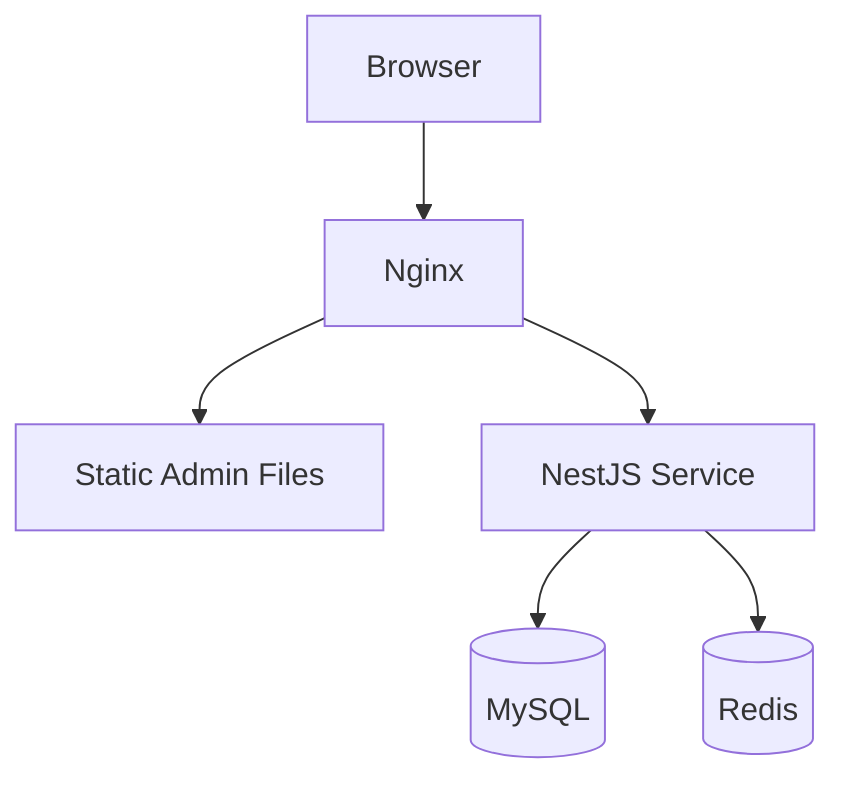
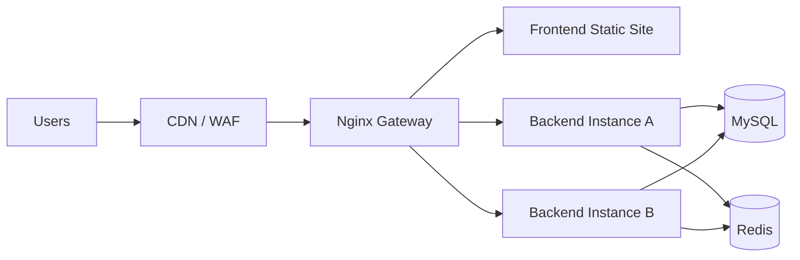

# 拓扑建议

## 怎么理解这页

这页不是教你具体敲哪些命令，而是帮助你判断 LuckyColor 在不同阶段应该采用什么样的部署形态。

选型时可以优先看三个问题：

1. 当前是内部开发、演示，还是正式对外服务？
2. 访问量和团队规模多大？
3. 是否已经进入多租户扩张期？

## 方案一：单机部署

适合：

- 本地演示
- 小团队内部使用
- 早期验证阶段

特点：

- 成本最低
- 部署最快
- 适合功能验证和交付演示

局限：

- 前后端、数据库、缓存都集中在一台机器
- 扩容能力差
- 任何单点故障都会影响整套系统

## 方案二：标准三层部署

适合：

- 小规模正式上线
- 有基本运维能力的中小型 SaaS 项目
- 需要前后端独立发布的场景

特点：

- 前端和后端职责清晰
- 后端可以水平扩容
- 更适合持续交付、灰度升级和问题隔离

建议：

- 前端静态资源通过 Nginx 或 CDN 分发
- 后端至少准备两台或两个实例
- MySQL 和 Redis 独立部署

## 方案三：多租户进阶方案

适合：

- 租户数量持续增长
- 对租户隔离和运维边界要求更高
- 需要逐步走向真正的平台化运维

可以考虑：

- 入口层按域名或二级域名区分租户
- 网关层统一处理限流、鉴权、审计
- 应用层多实例化
- 数据层从共享表逐步演进到更强隔离模式

这一阶段更关注的已经不是“能不能跑”，而是：

- 能不能稳定扩容
- 能不能快速定位租户问题
- 能不能对关键客户做更强的隔离保障

## 不同阶段的推荐方案

| 阶段 | 推荐方案 | 原因 |
| --- | --- | --- |
| 开发联调 | 本地部署或单机部署 | 环境简单、沟通成本低 |
| 客户演示 | 单机部署或 Docker Compose | 便于快速交付和复现 |
| 小规模正式上线 | 标准三层部署 | 发布、扩容、维护更稳妥 |
| 多租户扩张期 | 多租户进阶方案 | 便于按租户维度运营和扩展 |

## 与 LuckyColor 当前形态的匹配建议

结合当前项目实际情况：

- 文档、前端、后端分仓明确
- 平台已有完整租户能力
- 后端已经具备按租户上下文隔离数据的能力

因此更推荐：

- 开发和演示用本地或 Docker Compose
- 正式上线至少采用标准三层部署

如果直接把当前项目长期放在单机单实例模式，后续在租户数量增加时会比较吃力。

## 拓扑选型时要特别关注的点

### 文件存储

当前文件服务支持上传和读取。如果后端扩容成多实例，要考虑：

- 文件是否共享到对象存储或共享卷
- 是否还允许本地磁盘直存

### 缓存一致性

验证码、字典缓存等能力依赖 Redis，因此 Redis 应该是共享的，而不是每个实例一份。

### 日志与审计

`system_logs`、`security_audit_logs`、`tenant_audit_logs` 都是排查问题的重要依据。拓扑变复杂后，更要考虑日志采集和集中检索。

### 租户域名

如果走域名识别租户，入口层需要保留 `Host` 信息，并提前规划好通配域名和证书。

## 一句话建议

- 只想跑通：单机即可。
- 想稳定上线：至少三层。
- 想把 LuckyColor 真正作为 SaaS 平台持续运营：要尽早为多实例和多租户扩张预留拓扑空间。
