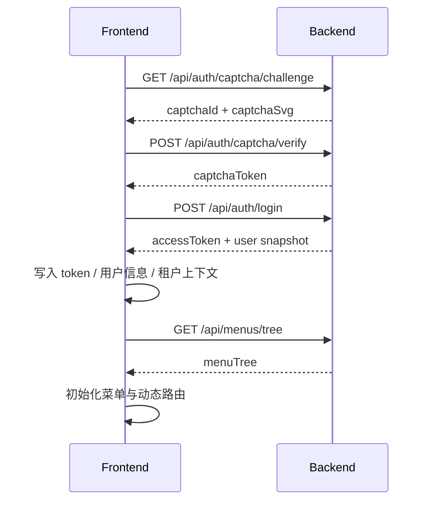
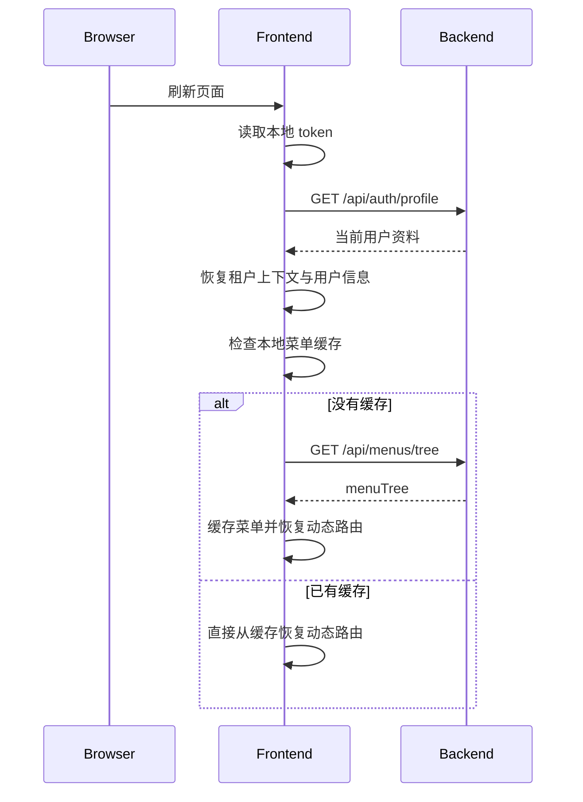

# 会话恢复与联调模式

## 这页解决什么问题

LuckyColor 前端有两个特别容易让接手者误解的点：

- 登录后到底是靠哪个接口把页面跑起来
- `dev / mock / hybrid` 三种模式到底怎么切换

这页专门把这两块说明白。

## 先说真实会话链路

### 登录成功时发生了什么

当前前端登录成功后的真实链路不是“只调一次 `/api/auth/access` 就完成初始化”，而是更接近下面这个流程：



### 当前前端实际怎么做

登录页完成的事情主要有：

1. 调用 `/api/auth/login`
2. 保存 `accessToken`
3. 保存当前用户基础资料
4. 保存当前租户上下文
5. 再调用 `/api/menus/tree`
6. 用菜单树初始化动态路由

所以如果你在联调时发现“登录成功但没菜单”，优先不要只盯 `/api/auth/access`，而要先看：

- `/api/auth/login`
- `/api/menus/tree`

## 页面刷新后是怎么恢复状态的

登录后刷新页面，前端走的是另一条链路。



### 为什么要拆成 `profile + menuTree`

这套设计的好处是：

- 用户资料恢复更轻量
- 菜单树可以单独缓存
- 页面刷新时不一定每次都重新走完整权限快照接口

## `/api/auth/access` 现在是什么角色

`/api/auth/access` 依然是有效接口，而且它返回的内容更完整，一般包含：

- 当前用户基础资料
- 角色列表
- 菜单树
- 菜单权限码
- 按钮权限码

所以它更像：

- 后端统一访问快照接口
- 调试权限问题时很有价值
- 安全和联调时的权威接口

但“当前前端默认初始化流程”并不是完全依赖它。

## 这三个接口怎么分工最容易理解

| 接口 | 适合拿来做什么 | 当前前端是否直接依赖 |
| --- | --- | --- |
| `/api/auth/login` | 登录并拿到 token 与用户快照 | 是 |
| `/api/auth/profile` | 刷新页面后恢复当前用户资料 | 是 |
| `/api/menus/tree` | 初始化或恢复菜单树与动态路由 | 是 |
| `/api/auth/access` | 查看完整访问快照、调试权限与联调 | 有，但不是唯一初始化入口 |

## 常见误区

### 误区 1：登录成功后菜单一定来自 `/api/auth/access`

当前前端实际不是这样。默认链路更偏向“登录拿用户，菜单单独拉树”。

### 误区 2：刷新页面后一定重新走完整登录链路

不是。刷新后的恢复重点是：

- token 仍然有效
- 用户资料可恢复
- 菜单缓存可恢复

### 误区 3：按钮权限只看前端控制

不是。前端只是显隐，最终还是以后端权限判断为准。

## 再说联调模式

LuckyColor 前端当前支持三种运行模式：

- 真实接口模式
- Mock 模式
- 混合模式

## 1. 真实接口模式

启动命令：

```powershell
pnpm dev
```

特点：

- 通过 Vite 代理把 `/api` 转到真实后端
- 最适合做完整联调
- 最容易发现租户、权限、菜单、数据范围等真实问题

适合场景：

- 联调真实后端
- 排查权限和租户问题
- 交付前验证真实链路

## 2. Mock 模式

启动命令：

```powershell
pnpm dev:mock
```

特点：

- 只使用本地 `mock/` 目录里已覆盖的接口
- 不依赖真实后端
- 更适合做离线演示和单纯的页面交互开发

适合场景：

- 后端未启动
- 临时演示页面
- 只想验证前端视觉与交互

## 3. 混合模式

启动命令：

```powershell
pnpm dev:hybrid
```

特点：

- 已覆盖的接口优先命中本地 Mock
- 未覆盖的接口继续转发到真实后端
- 适合边开发边联调

适合场景：

- 登录、菜单、字典等基础数据先走本地 Mock
- 复杂系统管理页继续联真实后端

## 三种模式怎么选

| 目标 | 推荐模式 |
| --- | --- |
| 验证真实权限、菜单、租户 | `pnpm dev` |
| 离线演示或只做前端页面开发 | `pnpm dev:mock` |
| 一部分接口本地模拟，一部分真实联调 | `pnpm dev:hybrid` |

## 本地排查时最有用的判断思路

### 登录成功但菜单没出来

优先检查：

1. `/api/auth/login` 是否返回了正常用户快照
2. `/api/menus/tree` 是否返回菜单树
3. 当前租户 Header 是否正确
4. 菜单 `component` 是否能映射到真实页面

### 刷新后白屏或路由丢失

优先检查：

1. 本地 token 是否还在
2. `/api/auth/profile` 是否成功
3. 菜单缓存是否存在
4. 动态路由是否已重新注册
5. Nginx 是否配置了 SPA 回退

### Mock 模式下页面能开，真实模式下报错

优先检查：

1. Mock 数据和真实接口字段是否一致
2. 真实接口是否要求租户 Header
3. 是否有权限码或菜单树差异
4. 页面是否误用了只在 Mock 中存在的字段

## 推荐配合阅读

- [前端说明](/frontend/overview)
- [前端模块渐进式解读](/frontend/module-walkthrough)
- [接口规范](/api/spec)
- [产品概述](/guide/overview)
