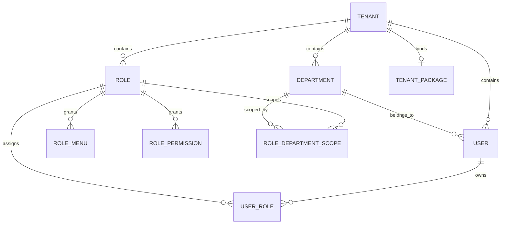

# 核心关系说明

## 先用一句话理解

LuckyColor 里最容易混淆的四个概念是：

- 租户：数据隔离边界
- 部门：组织归属结构
- 角色：授权载体
- 用户：被授权主体

如果先把这四个角色分清，后面再看权限、菜单、数据范围、租户初始化，就会清楚很多。

## 总体关系图



## 先讲最上层：租户

### 租户是什么

租户是 LuckyColor 的一级隔离边界。用户、角色、部门这些核心业务数据，都是先在租户范围内隔离，再谈权限控制。

这意味着：

- 不同租户的用户列表天然隔离
- 不同租户的角色编码可以重复，但在同一个租户内不能重复
- 不同租户的部门树彼此独立

### 租户和其他对象的关系

一个租户下面会挂：

- 多个部门
- 多个用户
- 多个角色
- 一个可选的租户套餐

也就是说，租户不是“附加属性”，而是整套后台数据的顶层边界。

## 再讲部门：组织归属，不是权限本体

### 部门是什么

部门是租户内部的组织树，用来表达“人属于哪个组织单元”。

部门本身解决的是：

- 组织展示
- 成员归属
- 负责人归属
- 数据权限计算的基础输入

### 部门的关键特点

- 部门是树结构，不是平铺列表
- 同一个租户内的部门编码唯一
- 用户最多挂一个部门

### 部门和用户的关系

用户表里有 `departmentId`，说明“这个用户当前归属哪个部门”。

所以“用户属于部门”是直接归属关系。

## 再讲角色：权限载体，不是组织归属

### 角色是什么

角色的作用不是给人分组，而是承载授权规则。

一个角色通常同时控制三类东西：

- 菜单权限
- 按钮权限
- 数据权限范围

### 角色和用户的关系

用户和角色是多对多，不是一人只能有一个角色。

这意味着：

- 一个用户可以同时拥有多个角色
- 一个角色也可以分配给多个用户

实际落地靠的是中间表 `user_roles`。

### 角色和部门的关系

这里最容易误解。

角色并不“属于某个部门”，角色和部门之间真正表达的是：

- 这个角色允许访问哪些部门的数据

也就是说，角色与部门之间不是组织归属关系，而是数据权限范围关系。

实际落地靠的是：

- `roles.dataScope`
- `role_department_scopes`

## 最后讲用户：归属部门，被授予角色

### 用户是什么

用户是最终登录系统、操作页面、访问接口的人。

它身上同时会带两类关键关系：

- 归属哪个租户
- 归属哪个部门

同时它还会通过角色，继承菜单、按钮和数据范围。

### 用户最终能看到什么，怎么决定

用户最终能访问什么，不是只看用户表本身，而是一个组合结果：

1. 当前用户属于哪个租户
2. 当前用户归属哪个部门
3. 当前用户绑定了哪些角色
4. 这些角色能访问哪些菜单、按钮、数据范围
5. 后端把多个角色合并成最终权限快照

## 重点：四者不是同一层关系

可以把它理解成两条线。

### 1. 组织线

租户 -> 部门 -> 用户

这条线回答的是：

- 你在哪个租户里
- 你属于哪个部门

### 2. 授权线

租户 -> 角色 -> 用户

再加上：

角色 -> 菜单
角色 -> 按钮权限
角色 -> 数据范围部门

这条线回答的是：

- 你能看什么页面
- 你能点什么按钮
- 你能看到哪些数据

## 数据权限到底怎么和部门挂钩

LuckyColor 当前的数据权限是按角色收敛的，而不是按前端传参决定的。

当前主要有这些范围：

- `ALL`：全部数据
- `DEPARTMENT`：本部门
- `DEPARTMENT_AND_CHILDREN`：本部门及子部门
- `SELF`：仅本人
- `CUSTOM`：自定义部门集合

### 这里最关键的理解

部门提供“组织树”，角色提供“数据范围规则”，用户提供“当前人是谁”。

三者结合后，后端才能算出：

- 这个用户查用户列表时，到底能看到哪些部门下的人

所以：

- 部门不是权限本身
- 角色不是组织归属
- 用户不是直接配置可见部门列表
- 真正的最终范围，是后端按角色集合计算出来的

## 平台管理员、租户管理员、租户成员的边界

当前系统里常见三类身份边界：

### 平台管理员

典型角色编码：`super_admin`

特点：

- 拥有平台级视角
- 能管理租户
- 数据范围通常是 `ALL`

### 租户管理员

典型角色编码：`tenant_admin`

特点：

- 只能在自己的租户内管理
- 一般负责本租户的用户、角色、菜单、部门、配置等
- 默认数据范围通常不是全平台，而是当前租户内的较大范围

### 租户普通成员

典型角色编码：`tenant_member`

特点：

- 只保留基础访问能力
- 数据范围通常偏小，例如仅本人

## 创建租户时，为什么这四者会一起出现

LuckyColor 的“创建租户”不是只新建一条 `tenant`。

创建租户时，系统通常还会一起初始化：

- 默认部门树
- 默认角色
- 默认管理员用户
- 角色菜单授权
- 角色按钮权限
- 角色部门范围
- 默认字典

所以从业务上说，“开通租户”其实等于“一次性搭起一个新的组织与授权空间”。

## 默认租户和新租户的区别

当前默认租户的种子数据里，一般会存在：

- `super_admin`
- `tenant_admin`
- `tenant_member`

而新建租户时，默认更关注租户侧可落地初始化，通常会直接生成：

- `tenant_admin`
- `tenant_member`

这意味着平台级超级管理员角色，并不是给每个新租户都复制一份。

## 一张图记住最关键结论

```text
租户 = 隔离边界
部门 = 组织归属
角色 = 授权规则
用户 = 最终使用者

用户归属部门
用户被分配角色
角色决定菜单 / 按钮 / 数据范围
数据范围会引用部门树
一切先受租户边界约束
```

## 接手时最容易犯的三种误解

### 误解 1：一个用户只有一个角色

不对。当前是多角色模型，最终权限是角色集合合并后的结果。

### 误解 2：角色属于部门

不对。角色和部门之间更多是“数据范围引用”关系，不是组织归属。

### 误解 3：前端决定数据权限

不对。前端最多透出上下文，真正的数据范围收敛发生在后端。

## 如果你现在要排查问题，先按这个顺序想

### 场景 1：用户查不到数据

先查：

1. 当前租户是否正确
2. 用户归属哪个部门
3. 用户绑定了哪些角色
4. 这些角色的数据范围是什么
5. 自定义部门范围是否配置完整

### 场景 2：用户能进页面但按钮不见了

先查：

1. 用户角色
2. 角色菜单授权
3. 角色按钮权限
4. 前端页面是否使用了权限控制

### 场景 3：新建租户后资源不完整

先查：

1. 租户是否创建成功
2. 默认部门是否初始化
3. 默认角色是否初始化
4. 管理员用户是否初始化
5. 菜单与权限是否绑定
6. 租户审计日志是否记录成功

## 推荐配合阅读

- [产品概述](/guide/overview)
- [前端说明](/frontend/overview)
- [后端说明](/backend/overview)
- [后端模块渐进式解读](/backend/module-walkthrough)
- [接口规范](/api/spec)
