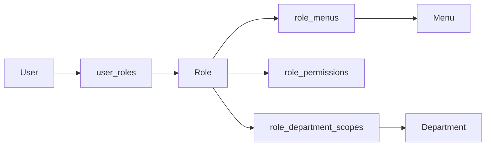

# 角色权限说明

## 权限模型概览

LuckyColor 当前采用的是一套“菜单权限 + 操作权限 + 数据权限 + 租户边界”组合模型。

可以简单理解为：

1. 先用登录态确认用户身份。
2. 再判断用户是否有目标菜单访问权。
3. 再判断是否有某个具体操作权限点。
4. 最后在查询或写入时收敛到租户范围和数据范围。

## 核心组成

### 菜单权限

菜单权限主要决定：

- 用户是否能看到某个菜单
- 前端是否构建某条动态路由
- 某些控制器模块是否允许访问

后端通过 `@RequireMenuPermission(...)` 装饰器做菜单级保护。

### 操作权限

操作权限点是更细粒度的按钮或行为许可，例如：

- `system:user:create`
- `system:user:update`
- `system:role:assign-menu`
- `tenant:package:delete`

后端通过 `@RequirePermissions(...)` 或 `@RequireAllPermissions(...)` 做校验。

### 数据权限

角色表中的 `dataScope` 决定一个角色能看哪些数据，例如：

- 全部数据
- 本部门数据
- 本部门及子部门数据
- 自定义部门范围

自定义部门范围通过 `role_department_scopes` 表落地。

### 租户边界

这是 SaaS 系统里最重要的一层隔离：

- 用户、角色、部门等主体都属于租户
- 查询通常附带 `tenant_id`
- 请求可通过 `x-tenant-id` 或登录态解析当前租户

## 默认权限点

系统内置的操作权限点主要分为以下几组：

### 用户管理

- `system:user:create`
- `system:user:update`
- `system:user:status`
- `system:user:reset-password`
- `system:user:assign-role`
- `system:user:delete`

### 角色管理

- `system:role:create`
- `system:role:update`
- `system:role:status`
- `system:role:data-scope`
- `system:role:assign-menu`
- `system:role:delete`

### 菜单管理

- `system:menu:create`
- `system:menu:sync`
- `system:menu:update`
- `system:menu:status`
- `system:menu:delete`

### 部门管理

- `system:department:create`
- `system:department:update`
- `system:department:status`
- `system:department:delete`

### 字典与配置

- `system:dictionary:create`
- `system:dictionary:refresh-cache`
- `system:dictionary:update`
- `system:dictionary:delete`
- `system:dictionary-type:create`
- `system:dictionary-type:update`
- `system:dictionary-type:delete`
- `system:dictionary-item:status`
- `system:dictionary-item:sort`
- `system:config:create`
- `system:config:refresh-cache`
- `system:config:update`
- `system:config:delete`

### 通知公告

- `system:notice:create`
- `system:notice:update`
- `system:notice:delete`

### 租户中心

- `tenant:tenant:create`
- `tenant:tenant:update`
- `tenant:package:create`
- `tenant:package:update`
- `tenant:package:delete`

## 默认角色

系统启动后的默认角色如下：

| 角色编码 | 说明 | 默认权限 |
| --- | --- | --- |
| `super_admin` | 平台超级管理员 | 全部系统操作权限 + 租户中心权限 |
| `tenant_admin` | 租户管理员 | 系统管理操作权限 |
| `tenant_member` | 普通租户成员 | 默认无直接操作权限 |

## 权限数据落地方式

## 前后端协作方式

前端登录后通常需要拉取：

- `/api/auth/profile`
- `/api/auth/access`
- `/api/auth/routes`
- `/api/auth/button-permissions`

用途分别对应：

- 当前用户资料
- 角色、菜单树与按钮权限快照
- 动态路由初始化
- 页面内按钮显隐控制

## 交付时建议强调的规则

- 菜单权限控制“能不能进页面”。
- 操作权限控制“能不能执行动作”。
- 数据权限控制“能看到哪些数据”。
- 租户边界控制“能不能访问这个租户的数据”。

## 生产安全建议

- 生产环境必须替换默认管理员密码。
- JWT 密钥需单独生成并安全保管。
- 建议限制 Swagger 只在内网或受保护环境开放。
- 关键操作应结合系统日志与安全审计日志保留痕迹。
- 涉及租户切换的接口应重点测试越权风险。
