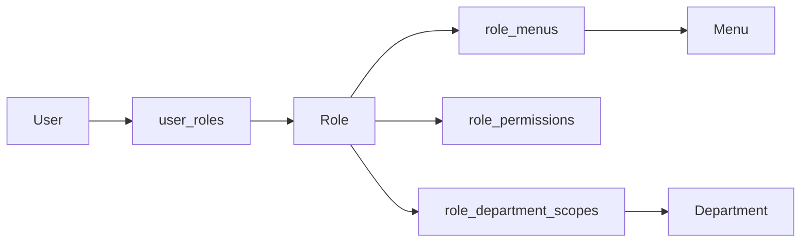

# 角色权限说明

## 权限模型概览

LuckyColor 当前采用的是一套“登录态 + 菜单权限 + 按钮权限 + 数据权限 + 租户边界”的组合模型。可以把它理解成五道连续关卡：

1. 先判断用户有没有登录。
2. 再判断用户能不能进入某个模块。
3. 再判断用户能不能执行某个动作。
4. 再判断用户能不能看到这部分数据。
5. 最后判断这份数据是不是属于当前租户。

这也是为什么平台既要做前端权限显隐，也要做后端权限校验。

如果你当前是在排查“为什么按钮没显示”“为什么接口返回 403”或者想核对前端页面使用的权限值与后端校验点，建议先看 [前后端权限码对照](/security/permission-alignment)，再回到本页理解完整权限模型。

## 权限体系由哪几部分组成

### 1. 登录认证

作用：

- 确认用户身份是否合法
- 确认 Token 是否有效
- 确认账号、角色、租户状态是否允许访问

主要相关接口：

- `POST /api/auth/login`
- `GET /api/auth/profile`
- `GET /api/auth/access`

### 2. 菜单权限

菜单权限控制：

- 用户是否能看到某个菜单
- 前端是否会注册某条动态路由
- 后端控制器是否允许访问某个模块

后端主要通过：

- NestJS 侧常见的 `@RequireMenuPermission(...)`
- NestJS 侧常见的 `@RequirePlatformMenuPermission(...)`
- Spring Boot 侧当前更常见的是 `@RequirePermission(...)` 与访问快照中的菜单 / 按钮权限联合裁决

来做控制。

### 3. 按钮权限

按钮权限是更细粒度的操作许可，例如：

- `system:user:create`
- `system:user:update`
- `system:user:delete`
- `system:role:authorize`
- `tenant:package:delete`

后端主要通过：

- NestJS 侧常见的 `@RequirePermissions(...)`
- Spring Boot 侧当前更常见的是 `@RequirePermission(...)`

来校验。

前端则会根据 `/api/auth/access` 或 `/api/auth/button-permissions` 返回的权限码控制按钮显隐。

如果你要对照前端常量值与 Spring Boot 真实权限码，或者理解前端语义别名和真实权限值的关系，可以继续看 [前后端权限码对照](/security/permission-alignment)。

### 4. 数据权限

数据权限的核心在角色表 `roles.data_scope`。常见范围包括：

- 全部数据
- 本部门数据
- 本部门及子部门数据
- 自定义部门范围

如果角色使用自定义范围，则会落到 `role_department_scopes` 表中。

这部分会直接影响：

- 用户分页查询
- 导出
- 某些部门或角色相关筛选

### 5. 租户边界

这是 SaaS 平台最底层也最重要的一道边界。

基本规则：

- 用户、角色、部门、公告等主体都属于租户
- 请求通常带有租户上下文
- 查询和写入默认都应落在当前租户范围内

租户识别优先级为：

1. 请求头 `x-tenant-id`
2. 域名后缀
3. Token
4. 默认租户配置

## 默认角色

系统初始化后常见默认角色如下：

| 角色编码 | 说明 | 默认能力 |
| --- | --- | --- |
| `super_admin` | 平台超级管理员 | 可访问平台级系统管理与租户中心 |
| `tenant_admin` | 租户管理员 | 可访问当前租户内的大部分系统管理能力 |
| `tenant_member` | 普通租户成员 | 默认不具备高权限操作能力 |

## 默认权限点

### 用户管理

- `system:user:create`
- `system:user:update`
- `system:user:reset-password`
- `system:user:assign-role`
- `system:user:delete`

### 角色管理

- `system:role:create`
- `system:role:update`
- `system:role:authorize`
- `system:role:delete`

### 菜单管理

- `system:menu:create`
- `system:menu:update`
- `system:menu:delete`

### 部门管理

- `system:department:create`
- `system:department:update`
- `system:department:delete`

### 字典与配置

- `system:dictionary:create`
- `system:dictionary:refresh-cache`
- `system:dictionary:update`
- `system:dictionary:delete`
- `system:dictionary-type:create`
- `system:dictionary-type:update`
- `system:dictionary-type:delete`
- `system:dictionary-item:status`
- `system:dictionary-item:sort`
- `system:config:create`
- `system:config:refresh-cache`
- `system:config:update`
- `system:config:delete`

### 通知公告

- `system:notice:create`
- `system:notice:update`
- `system:notice:delete`

### 租户中心

- `tenant:create`
- `tenant:update`
- `tenant:delete`
- `tenant:package:create`
- `tenant:package:update`
- `tenant:package:delete`

## 权限数据在数据库里怎么落地

可以这样理解：

- 用户通过 `user_roles` 拿到角色
- 角色通过 `role_menus` 决定可访问菜单
- 角色通过 `role_permissions` 决定可执行动作
- 角色通过 `role_department_scopes` 决定数据范围

## 前后端协作关系

### 后端负责最终裁决

即使前端隐藏了按钮、屏蔽了菜单，后端仍然会再次判断权限。前端的权限控制主要用于体验层，不能替代服务端校验。

### 前端负责可视化呈现

前端登录后通常会依次拉取：

- `/api/auth/profile`
- `/api/auth/access`
- `/api/auth/routes`
- `/api/auth/button-permissions`

它们分别用于：

- 当前用户资料
- 菜单树、角色和按钮权限快照
- 动态路由初始化
- 页面内按钮显隐控制

## 接手项目时最容易误解的地方

### 菜单权限不等于按钮权限

有菜单权限，只表示“可以看到页面或进入模块”，不代表一定可以新增、删除、导出。

### 按钮隐藏不等于接口安全

接口是否安全，以后端权限装饰器和租户边界为准，不能只靠前端控制。

### 数据权限和租户边界不是一回事

- 租户边界解决“是不是这个租户的数据”
- 数据权限解决“在这个租户里能看到哪些部门或哪些对象”

### 平台管理员和租户管理员边界不同

租户中心通常属于平台级能力，不是所有租户管理员都应该拥有。

如果你想把这部分边界直接按“平台管理员 / 租户管理员 / 普通成员”三类身份对照成一张矩阵，可以继续阅读 [身份边界矩阵](/security/actor-boundary-matrix)。

## 常见排查路径

### 现象：菜单不显示

优先检查：

- 当前账号是否有对应角色
- 角色是否绑定了对应菜单
- 菜单是否启用
- 当前租户是否正确

### 现象：页面能进，但按钮不显示

优先检查：

- 当前角色是否有对应按钮权限码
- `/api/auth/button-permissions` 返回是否正确
- 前端按钮权限判断是否写对

### 现象：接口返回 403

优先检查：

- Token 是否有效
- 菜单权限是否满足
- 按钮权限是否满足
- 数据权限是否超范围
- 当前租户是否禁用、冻结或过期

### 现象：列表数据比预期少

优先检查：

- 角色的 `data_scope`
- 是否配置了 `role_department_scopes`
- 当前租户上下文是否正确

## 生产安全建议

- 生产环境必须替换默认管理员密码。
- `JWT_SECRET` 必须使用强随机值。
- Swagger 尽量限制在内网或受保护环境。
- 关键接口既要做权限校验，也要保留系统日志和安全审计日志。
- 涉及租户切换、租户创建、角色授权、菜单授权的能力，发布前必须重点回归。
